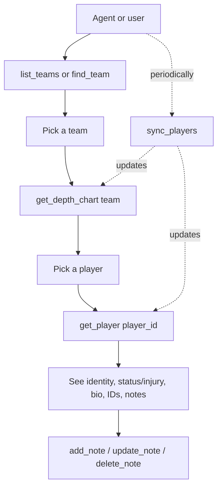

# Sleeper Sync, Teams, and Depth Chart Navigation

## Problem Frame

Today the MCP only knows about players the user has typed in by hand. To make pre-snap decisions in Claude, the user wants the server to mirror Sleeper's authoritative NFL roster data, organize it by team, and let an agent navigate from "search/pick a team" → "see the depth chart" → "open a player" → "read details and notes." Existing notes are not worth migrating; the user prefers a clean rebuild around Sleeper IDs.

## User Flow

## Requirements

**Sleeper sync**

- R1. The system pulls the full NFL player payload from Sleeper's public players endpoint and writes it into SQLite, replacing existing player rows.
- R2. Sync filters to fantasy-relevant positions only: QB, RB, WR, TE, K, DEF. Non-matching records are skipped.
- R3. Sync is exposed as both a console script (e.g. `ffpresnap-sync`) and an MCP tool (`sync_players`). Both call the same underlying logic.
- R4. The system records the timestamp and outcome of each sync (started_at, finished_at, players_written, source endpoint) and exposes a `last_sync` tool that returns the most recent record.
- R5. Sync is idempotent — running it twice in a row produces the same end state. Players removed by Sleeper since the last sync are removed locally.

**Schema and data model**

- R6. On first install of this version, the existing `players` and `notes` tables are wiped. There is no migration of prior user-added players or notes.
- R7. The new `players` table is keyed by Sleeper's `player_id` (string). It stores at minimum: full_name, first_name, last_name, team (abbr), position, fantasy_positions, jersey number, depth_chart_position, depth_chart_order, status, injury_status, injury_body_part, injury_notes, practice_participation, age, birth_date, height, weight, years_exp, college, and cross-platform IDs (espn_id, yahoo_id, rotowire_id, sportradar_id).
- R8. There is no separate depth_chart table. The depth chart for a team is derived at read time by selecting players where `team = ?`, grouped by `depth_chart_position`, ordered by `depth_chart_order`.
- R9. A `teams` table is seeded once with all 32 NFL teams: abbreviation (PK), full_name, conference (AFC/NFC), division (North/South/East/West). Seed is idempotent and independent of Sleeper sync.
- R10. The `notes` table keeps its current shape but `player_id` becomes a foreign key to the new Sleeper-keyed `players` table. Cascading delete on player removal is preserved.

**Read tools (MCP surface)**

- R11. `list_teams(query?)` — list all 32 teams, or filter by substring match against abbreviation, full name, conference, or division.
- R12. `get_depth_chart(team)` — given a team identifier (abbr or full name), return that team's players grouped by depth_chart_position and ordered by depth_chart_order, with each entry showing enough fields to identify the player and their status.
- R13. `find_player(query)` — case-insensitive substring search on player name (Sleeper-backed). Caps at a reasonable result count.
- R14. `get_player(player_id)` — return the full stored detail for a player plus their notes (newest first).
- R15. `list_players(team?, position?)` — optional filtered listing for cases where the agent wants a flat list rather than a depth chart view.

**Write tools (MCP surface)**

- R16. `add_player`, `delete_player`, and any other manual player-creation paths are removed. Players exist only because Sleeper says they do.
- R17. Notes tools (`add_note`, `list_notes`, `update_note`, `delete_note`) remain, attaching to a Sleeper `player_id`. `add_note` no longer accepts a name fallback that creates a player — the player must already exist from sync.

## Success Criteria

- After running `sync_players` once on a fresh install, the user can ask Claude "show me the Chiefs depth chart" and get back a usable, ordered list grouped by position.
- The user can drill from a depth chart entry into a player detail view that shows status/injury and any notes attached.
- The user can ask "when did we last sync?" and get a clear answer.
- The DB stays small enough (low thousands of rows) that all read tools return promptly without pagination.

## Scope Boundaries

- No depth chart overrides, manual orderings, or hand-edited starter/backup labels. The depth chart is always whatever Sleeper says it is.
- No historical snapshots of depth charts or player status over time — only the current state.
- No live game data, stats, projections, or matchups in this iteration.
- No support for non-fantasy positions (OL, IDP, special teams beyond K/DEF).
- No multi-sport support — NFL only.
- No automatic/scheduled sync built into the MCP itself; if the user wants cron, they wire it up around the CLI script.
- No migration of existing notes; existing data is wiped.

## Key Decisions

- **Sleeper is the only source of truth for players.** Rationale: avoids a parallel manual-player concept, keeps the data model small.
- **Wipe existing data on upgrade.** Rationale: user has no notes worth preserving and wants a clean rebuild around Sleeper IDs. Saves writing migration/fuzzy-match/orphan logic.
- **Depth chart is derived, not stored separately.** Rationale: Sleeper's player records already carry `depth_chart_position` and `depth_chart_order`; a separate table would just duplicate that data and create a freshness risk.
- **Teams table is hardcoded with metadata.** Rationale: 32 teams change rarely; hardcoding lets users search by name or division (e.g., "AFC West") without depending on Sleeper's vocabulary or having to derive it on each sync.
- **Sync is exposed both as CLI and as MCP tool.** Rationale: the user wants both agent-invokable sync and the option to cron it; tracking `last_sync` makes either path observable.
- **Filter to fantasy positions only.** Rationale: keeps the DB lean and the depth chart focused on positions the user actually drafts.

## Dependencies / Assumptions

- Sleeper's public NFL players endpoint (`https://api.sleeper.app/v1/players/nfl`) remains free, unauthenticated, and returns the documented shape. *(Unverified by this brainstorm — the planner should confirm payload shape and field names against a live response before locking the schema.)*
- Sleeper's per-player payload includes `depth_chart_position` and `depth_chart_order` for the players we care about. *(Unverified — needs confirmation during planning; if a meaningful share of fantasy-relevant players have nulls, R8/R12 may need a fallback ordering rule.)*
- Sleeper's recommended polling cadence for the full player dump is no more than once per day. The user is expected to respect this; the system does not enforce a minimum interval.

## Outstanding Questions

### Resolve Before Planning

_(none — all blocking product decisions are resolved.)_

### Deferred to Planning

- [Affects R8, R12][Needs research] What is the right ordering when `depth_chart_position` or `depth_chart_order` is null for a fantasy-relevant player? (Sort to bottom? Group as "unranked"? Validate prevalence first.)
- [Affects R12][Technical] How should `get_depth_chart` resolve a team identifier — strictly by abbreviation, or also accept full-name / nickname (e.g., "Chiefs", "Kansas City")?
- [Affects R1, R5][Technical] How does sync handle partial failure (network error mid-write)? Likely a transactional swap (write to staging, then atomic replace) — confirm during planning.
- [Affects R3][Technical] CLI script entry point name and where it lives in `pyproject.toml`.
- [Affects R7][Needs research] Confirm exact Sleeper field names and types against a live response before locking the schema (Sleeper has historically returned some fields as strings that look numeric).

## Next Steps

→ `/ce:plan` for structured implementation planning
