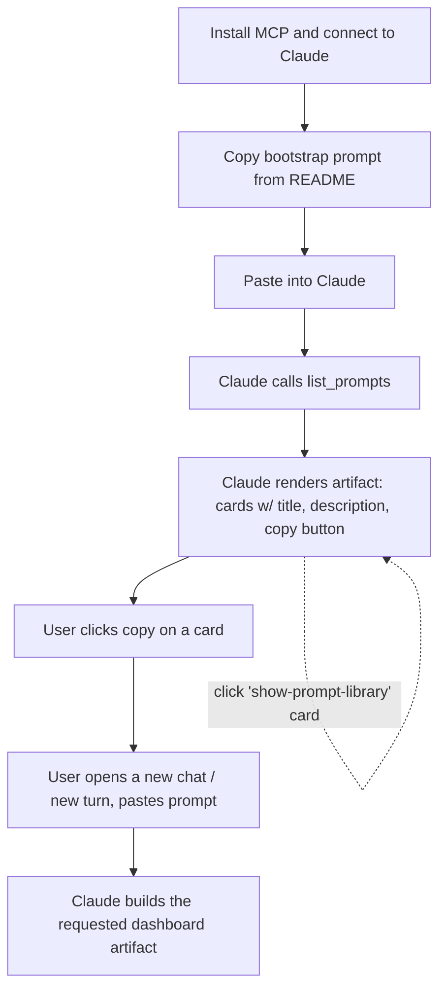

# Prompt Library and Onboarding Artifact

## Problem Frame

A new user installs ffpresnap, connects the MCP to Claude, and faces a cold start: they know there are tools, but not what to *do* with them. The most useful interactions (browse studies, drill into depth charts, scan recent notes) require knowing exactly what to ask Claude to build. We want an onboarding surface that hands the user a curated menu of pre-baked prompts — each one a one-click recipe for a useful Claude artifact (study browser, depth-chart explorer, note feed, etc.) — so the value of the MCP is discoverable on day one.

The library is a small, curated catalog of prompts shipped in the repo. A new tool returns the catalog; Claude renders it as an artifact with copy-to-clipboard cards; the user clicks one, pastes it into a fresh chat, and Claude generates the requested dashboard artifact using the existing MCP tools.

## User Flow

## Requirements

**Prompt storage and seeding**

- R1. Prompts are authored as files in the repo (one prompt per file), under a dedicated directory. The repo is the source of truth.
- R2. On every database open, the prompt set in the repo is reconciled into the local DB: new entries inserted, changed entries updated, prompts removed from the repo are removed from the DB. This mirrors the existing `teams` seeding pattern. User-modified prompts in the DB get clobbered — this is by design.
- R3. Each prompt carries: `slug` (stable id, kebab-case), `title`, `description` (one-liner the artifact card shows), and `body` (the prompt text the user copies).

**MCP tool surface**

- R4. A new MCP tool returns the full set of prompts (`slug`, `title`, `description`, `body`) so an artifact can render them.
- R5. The tool is read-only — there are no mutation tools for prompts (consistent with R2's repo-as-truth model).

**Onboarding entry point**

- R6. The README has a "Getting started" section with a copy-pasteable bootstrap prompt. The bootstrap prompt instructs Claude to call the prompt-library tool and render the result as an artifact with cards (title + description + copy button per prompt).
- R7. A library entry with slug `show-prompt-library` is included in the v1 set, so the user can re-summon the library artifact from a card click rather than going back to the README. Its body is the same bootstrap prompt the README ships.

**v1 prompt set**

- R8. Ship these 7 prompts in v1:
  - `show-prompt-library` — re-opens this library artifact.
  - `study-browser` — list studies, drill into one to see its notes and mentioned players/teams.
  - `depth-chart-explorer` — pick a team, render the depth chart grouped by position with player status.
  - `note-recency-feed` — chronological feed of all notes with subject info and mentions.
  - `player-card` — pick a player, render full detail (identity, status/injury, bio) plus their notes and mention list.
  - `team-overview` — team page combining depth chart, team notes, and notes mentioning the team.
  - `mention-graph` — node-link visualization of who-mentions-whom across notes (nodes are players and teams, edges are notes).

**Prompt body conventions**

- R9. Each prompt body is a complete, self-contained instruction Claude can execute against the existing MCP tools. It names the tools to call, the data shape to expect, and the visual layout / interactions for the resulting artifact (cards, lists, search, filters, etc.).
- R10. Prompt bodies do not embed live data; they reference the MCP tools by name (e.g. "call `list_notes` with `scope='recent'`"). This keeps prompts evergreen as the local DB evolves.

## Success Criteria

- A new user, ten minutes after installing the MCP, has copy-pasted the bootstrap from the README, seen the library artifact render with all 7 cards, and successfully launched at least one dashboard artifact.
- Adding a new prompt to the project is a one-file change in the repo plus a sync — no DB hand-edit, no migration.
- The library artifact is re-summonable from inside itself; the user does not have to revisit the README after first install.

## Scope Boundaries

- No prompt-mutation tools (no `add_prompt` / `delete_prompt`). Library is curated via PRs.
- No user-defined custom prompts in v1. If demand emerges, a separate "user prompts" concept can be added later (matches the alternative considered during brainstorming but explicitly out of scope here).
- No telemetry on which prompts are used.
- The dashboards themselves are *not* shipped as code in this repo. They are produced on-the-fly by Claude reading the prompt body and writing artifact code in the conversation.
- No prompt versioning, no migration of old prompt slugs to new ones — if a slug is renamed, the old one is removed and the new one is inserted (R2).
- Prompt bodies do not depend on any new MCP capabilities. They use the existing 18-tool surface as-is.

## Key Decisions

- **Repo is source of truth, overwrite on open.** Mirrors the `teams.py` seeding pattern. Trade-off accepted: users can't customize prompts in their local DB. Adding/editing prompts is a PR-shaped activity. Rationale: the v1 user is also the owner of the repo for now; the customization need isn't real yet.
- **Prompts authored as separate files, not a single Python list.** One prompt per file keeps bodies readable (they'll be 20–80 lines of markdown-flavored instructions) and makes PRs that add a prompt low-friction.
- **Tool name: `list_prompts`, not `prompt_library`.** Brainstorm input used `prompt_library`; renamed for consistency with `list_studies`, `list_teams`, `list_players`, `list_notes`. The *concept* is still "the prompt library"; only the tool name follows the established `list_*` convention.
- **Self-referential library entry.** `show-prompt-library` exists in the catalog. Tiny addition, big re-discoverability win — users don't need to bookmark the README.
- **Prompts reference tools by name, not by data.** A prompt body says "call `list_notes` with `scope='recent'`," not "here are the current notes." The library stays evergreen as the DB evolves.

## Dependencies / Assumptions

- Claude (Desktop / Code / Cowork) renders artifacts when the assistant generates them; the MCP returns plain JSON. This is how Claude artifacts already work — verified, not assumed.
- The existing 18-tool MCP surface is sufficient for the seven v1 dashboards. (List ✓, get ✓, depth chart ✓, mentions ✓, recent feed ✓.)
- Prompt files live under a directory chosen during planning (e.g. `src/ffpresnap/prompts/` or `prompts/` at repo root). Exact path is a planning concern.

## Outstanding Questions

### Resolve Before Planning

_(none — all blocking product decisions are resolved.)_

### Deferred to Planning

- [Affects R1, R2][Technical] File format for prompt definitions: TOML / YAML / a small Python module per prompt / front-mattered Markdown. Should be decided during planning based on what fits the repo's existing conventions and the prompt-body length characteristics.
- [Affects R1][Technical] Exact directory location for prompt files (`src/ffpresnap/prompts/` vs `prompts/` at repo root).
- [Affects R2][Technical] Whether reconciliation runs unconditionally on every `Database.open()` or is gated to once per process startup. The teams seed runs every open today; following that pattern is fine but worth confirming `EXPLAIN QUERY PLAN` shows it stays cheap as the catalog grows.
- [Affects R8][Editorial] The actual prompt body text for each of the seven v1 prompts. Each body needs to be written as a substantive instruction that produces a good Claude artifact. This is editorial work, not architectural — best done during implementation with iteration.
- [Affects R4][Technical] Whether `list_prompts` is added inside the existing 18-tool surface (becoming 19) or whether it warrants any related lookup tool (e.g. `get_prompt(slug)`). Default: just `list_prompts` returning the full set; revisit if the catalog grows past 30 entries.

## Next Steps

→ `/ce:plan` for structured implementation planning
