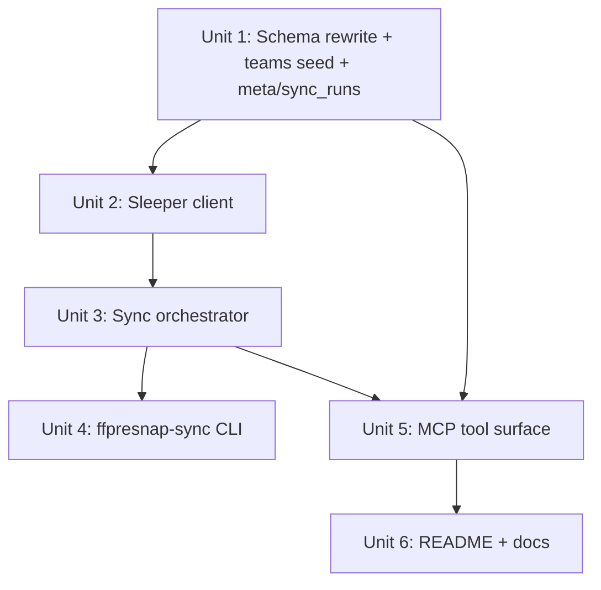

# feat: Sleeper sync, teams table, and depth-chart navigation

## Overview

Replace the hand-curated `players` table with one mirrored from Sleeper's public NFL player dump, add a hardcoded `teams` table, and expose MCP tools for navigating "team → depth chart → player → notes." Sync runs as both a CLI and an MCP tool, and the system records when it last ran. Existing players/notes are wiped on upgrade (per origin decision).

## Problem Frame

Today the MCP only contains players the user typed in by hand, so depth-chart navigation isn't possible and notes aren't keyed to anything stable. The user wants Sleeper to be the source of truth so an agent can drill from a team picker into a depth chart into a player detail with notes (see origin: `docs/brainstorms/2026-04-26-sleeper-sync-and-team-depth-chart-requirements.md`).

## Requirements Trace

- R1–R5: Sleeper sync (CLI + MCP tool, fantasy positions only, idempotent, last_sync recorded). Advanced by Units 2, 3, 4.
- R6–R10: Schema rewrite (wipe + Sleeper-keyed players, no depth_chart table, hardcoded teams, notes FK). Advanced by Unit 1.
- R11–R15: Read tools (list_teams, get_depth_chart, find_player, get_player, list_players). Advanced by Unit 5.
- R16–R17: Removal of manual player tools; notes attach to Sleeper IDs. Advanced by Unit 5.

## Scope Boundaries

- No depth-chart overrides, history, or hand-edited orderings.
- No live game/stats/projections.
- No non-fantasy positions.
- No multi-sport.
- No scheduled/auto sync inside the MCP process.
- No migration of existing players or notes — they are dropped.

## Context & Research

### Relevant Code and Patterns

- `src/ffpresnap/db.py` — `Database` class wraps a single `sqlite3.Connection`, runs `SCHEMA` on init via `executescript`, exposes typed methods returning `dict[str, Any]`. Mirror this style for new tables and sync state.
- `src/ffpresnap/server.py` — declarative `TOOLS` list + a single `handle_tool_call` dispatcher returning plain dicts. New tools follow the same shape.
- `tests/test_db.py` and `tests/test_server.py` — `db` fixture using `tmp_path`, one test per behavior, raises-based error checks. Mirror exactly.
- `pyproject.toml` — entry points live under `[project.scripts]`; `ffpresnap-mcp = "ffpresnap.server:main"` is the existing pattern; new `ffpresnap-sync` entry point follows it.

### Institutional Learnings

- `docs/solutions/` not present in this repo; nothing to import.

### External References

- Sleeper Players API: `GET https://api.sleeper.app/v1/players/nfl` returns a JSON object keyed by Sleeper `player_id` (string). Per-player payload includes `full_name`, `first_name`, `last_name`, `team`, `position`, `fantasy_positions`, `number`, `depth_chart_position`, `depth_chart_order`, `status`, `injury_status`, `injury_body_part`, `injury_notes`, `practice_participation`, `age`, `birth_date`, `height`, `weight`, `years_exp`, `college`, plus cross-platform IDs (`espn_id`, `yahoo_id`, `rotowire_id`, `sportradar_id`). Sleeper recommends polling once per day at most.

## Key Technical Decisions

- **Use stdlib `urllib.request` + `json`, not a new dependency.** The sync is a single GET of a JSON document; adding `httpx`/`requests` is unjustified weight for one call.
- **Transactional swap on sync.** Write fetched rows into a staging table (or use a single transaction with `DELETE` + `INSERT`), commit atomically. A mid-sync failure must leave the previous good dataset intact (R5).
- **Sleeper `player_id` (TEXT) as primary key on `players`.** Keep the surface honest — every player exists because Sleeper says they exist (R6, R7, R16).
- **`teams` table is seeded from a Python constant, not from sync.** 32 rows, hardcoded `(abbr, full_name, conference, division)`. Seeded idempotently on `Database` open, independent of Sleeper (R9).
- **No `depth_chart` table.** `get_depth_chart` is a query: `WHERE team = ? ORDER BY depth_chart_position, depth_chart_order, full_name` (R8). Players with NULL `depth_chart_position` are returned in a separate "unranked" group at the end so they aren't silently dropped.
- **`sync_runs` table records every run.** Columns: `id`, `started_at`, `finished_at`, `players_written`, `source_url`, `status` (`success`/`error`), `error` (nullable). `last_sync` returns the most recent row. Failed runs are recorded too so the user can see when a run was attempted.
- **Wipe by dropping and recreating tables on a schema-version bump.** Use a `schema_version` PRAGMA-style row in a tiny `meta` table; on open, if version < 2, drop `players`/`notes` and recreate. This keeps the wipe automatic for the user's existing DB.
- **Team identifier resolution is permissive.** `get_depth_chart(team)` accepts an abbreviation (`KC`), a full name (`Kansas City Chiefs`), or a unique nickname suffix (`Chiefs`); ambiguous matches raise. Matches go through the `teams` table.

## Open Questions

### Resolved During Planning

- _Where do we store sync history?_ → New `sync_runs` table; `last_sync` reads the most recent row.
- _How do we wipe existing data?_ → `schema_version` row in a `meta` table; bump to 2, drop & recreate on open.
- _Which HTTP client?_ → `urllib.request` from stdlib.
- _How to resolve a team identifier?_ → Match against `teams` (abbr / full_name / suffix-of-full_name); ambiguous raises a clear error.
- _NULL `depth_chart_position` handling?_ → Return as a trailing "unranked" group, not dropped.

### Deferred to Implementation

- Exact field-name list for the players table once a live Sleeper response is inspected (some fields may be string-typed where they look numeric, e.g. `years_exp`). The `Database.add_or_replace_players` writer should defensively coerce only the fields it actually filters on.
- Whether to gzip-decode manually — `urllib` may or may not transparently decode depending on what Sleeper returns.
- Final verbiage of error messages surfaced through `ToolError`.

## High-Level Technical Design

> *This illustrates the intended approach and is directional guidance for review, not implementation specification. The implementing agent should treat it as context, not code to reproduce.*

```
                ┌──────────────────────┐
                │ ffpresnap-sync (CLI) │
                └──────────┬───────────┘
                           │ calls
┌──────────────────────────▼───────────────────────────┐
│ sync.run_sync(db)                                    │
│   1. record sync_run(start)                          │
│   2. GET sleeper /v1/players/nfl                     │
│   3. filter to fantasy positions {QB,RB,WR,TE,K,DEF} │
│   4. project to stored field set                     │
│   5. BEGIN; DELETE players; INSERT new rows; COMMIT  │
│   6. record sync_run(finish, count, status)          │
└──────────────────────────┬───────────────────────────┘
                           │ same call path
                ┌──────────▼─────────┐
                │ MCP: sync_players  │
                └────────────────────┘

  Read tools (server.py):
    list_teams   → SELECT FROM teams
    get_depth_chart(team)
                 → resolve team via teams table
                 → SELECT FROM players WHERE team=? ORDER BY ...
    find_player  → name LIKE
    get_player   → players row + notes for player_id
    list_players → optional team/position filter
    list_notes / add_note / update_note / delete_note  (player_id is TEXT)
```

## Implementation Units



- [ ] **Unit 1: Schema rewrite, teams seed, meta + sync_runs**

**Goal:** Replace existing tables with the Sleeper-keyed model, seed the 32-team metadata, and add `meta` + `sync_runs` tables for versioning and sync history.

**Requirements:** R6, R7, R8, R9, R10

**Dependencies:** None.

**Files:**
- Modify: `src/ffpresnap/db.py`
- Create: `src/ffpresnap/teams.py` (constant list of 32 NFL teams: abbr, full_name, conference, division)
- Modify: `tests/test_db.py`

**Approach:**
- Add a `meta(key TEXT PRIMARY KEY, value TEXT NOT NULL)` table; on open, read `schema_version`. If absent or `< 2`, drop `players` and `notes`, run new schema, set `schema_version = 2`.
- New `players` table:
  - `player_id TEXT PRIMARY KEY` (Sleeper id)
  - identity/position fields (R7), status/injury fields, bio fields, cross-platform id fields, `updated_at TEXT NOT NULL`
- New `notes` table identical to current shape but `player_id TEXT REFERENCES players(player_id) ON DELETE CASCADE`. Index on `(player_id, created_at DESC)`.
- New `teams(abbr TEXT PRIMARY KEY, full_name TEXT NOT NULL, conference TEXT NOT NULL, division TEXT NOT NULL)`. Idempotent seed via `INSERT OR IGNORE` from `teams.TEAMS` on every open.
- New `sync_runs(id INTEGER PK AUTOINC, started_at TEXT NOT NULL, finished_at TEXT, players_written INTEGER, source_url TEXT NOT NULL, status TEXT NOT NULL, error TEXT)`.
- Remove `add_player`, `delete_player`, `find_player_by_name`, `DuplicatePlayerError`, `AmbiguousPlayerError` from `db.py` (no longer used; per R16 manual player creation is gone).
- Add new methods: `replace_players(rows)` (transactional), `get_player(player_id: str)`, `list_players(team=None, position=None)`, `find_players(query, limit=10)`, `list_teams(query=None)`, `get_team(identifier)` (permissive match returning a single team or raising ambiguous/not-found), `depth_chart(team_abbr)`, `record_sync_start(source_url)`, `record_sync_finish(run_id, players_written, status, error=None)`, `last_sync()`.
- `add_note`/`list_notes`/`update_note`/`delete_note` keep their shape but switch `player_id` to `str`.

**Patterns to follow:**
- Existing `Database.__init__` style (executescript on open).
- Existing row-builder helpers (`_player_row`, `_note_row`).

**Test scenarios:**
- Happy path: opening a fresh DB seeds all 32 teams with correct conference/division.
- Edge case: opening a DB that already has `schema_version = 2` does not re-drop existing rows (idempotent open).
- Edge case: opening an old DB (no `meta` table, has legacy `players`/`notes`) drops them and reaches `schema_version = 2`.
- Happy path: `replace_players([...])` followed by `list_players()` returns exactly the new set.
- Happy path: `replace_players` is transactional — a row that violates a constraint mid-batch leaves the prior dataset intact (use a forced failure, e.g. duplicate primary key in the input).
- Happy path: `depth_chart("KC")` returns players ordered by `(depth_chart_position, depth_chart_order, full_name)`, with NULL `depth_chart_position` rows in a trailing "unranked" group.
- Happy path: `get_team("KC")`, `get_team("Kansas City Chiefs")`, and `get_team("Chiefs")` all resolve to the same team.
- Error path: `get_team("ets")` (ambiguous suffix matching Jets and Patriots? construct a deliberately ambiguous case) raises a clear ambiguous error.
- Error path: `get_team("Foo")` raises not-found.
- Happy path: notes cascade-delete when a player is removed via `replace_players` (i.e. player not present in new set).
- Happy path: `record_sync_start` + `record_sync_finish` round-trip; `last_sync()` returns the most recent row including failure rows.

**Verification:**
- `pytest tests/test_db.py` passes; old tests covering manual `add_player` / duplicate detection are removed and replaced with the above.

---

- [ ] **Unit 2: Sleeper HTTP client**

**Goal:** Fetch the full NFL player payload from Sleeper and return it as a parsed dict, with a clean seam for tests to substitute a fake.

**Requirements:** R1

**Dependencies:** None (independent of Unit 1; merged after for ease of review).

**Files:**
- Create: `src/ffpresnap/sleeper.py`
- Create: `tests/test_sleeper.py`

**Approach:**
- One module-level constant: `PLAYERS_URL = "https://api.sleeper.app/v1/players/nfl"`.
- One function: `fetch_players(url: str = PLAYERS_URL, *, opener=None) -> dict[str, dict]`. Uses `urllib.request` with a sane timeout (e.g. 30s). Returns the parsed JSON dict.
- The optional `opener` parameter (or simple URL substitution) is the test seam. No global state.
- Define a `SleeperFetchError` exception wrapping network/parse failures.

**Patterns to follow:**
- Module-level pure functions (mirroring `db.py`'s style of small functions plus a class).

**Test scenarios:**
- Happy path: a fake opener returning a small JSON dict yields the expected dict.
- Error path: HTTP error → `SleeperFetchError` with status info.
- Error path: malformed JSON → `SleeperFetchError`.
- Edge case: empty body → `SleeperFetchError` (not silently empty dict).

**Verification:**
- `pytest tests/test_sleeper.py` passes. No real network call is made in tests.

---

- [ ] **Unit 3: Sync orchestrator**

**Goal:** Glue Sleeper fetch → filter → project → atomic replace → record sync run, behind a single function shared by CLI and MCP.

**Requirements:** R1, R2, R4, R5

**Dependencies:** Units 1 and 2.

**Files:**
- Create: `src/ffpresnap/sync.py`
- Create: `tests/test_sync.py`

**Approach:**
- `FANTASY_POSITIONS = frozenset({"QB", "RB", "WR", "TE", "K", "DEF"})`.
- `run_sync(db: Database, *, fetch=fetch_players, source_url=PLAYERS_URL) -> dict` returns a summary `{"run_id", "players_written", "status", "error"?}`.
  - Calls `db.record_sync_start(source_url)` → gets `run_id`.
  - Try: fetch payload, filter to fantasy positions (consider both `position` and `fantasy_positions` — keep player if either intersects the allowed set), project each player to the stored field shape (use a single `_project(player_dict)` helper), then `db.replace_players(rows)`.
  - On success: `db.record_sync_finish(run_id, len(rows), "success")`.
  - On any exception: `db.record_sync_finish(run_id, 0, "error", error=str(e))` then re-raise (CLI catches; MCP wraps in `ToolError`).
- `_project` reads only the documented field set; missing keys default to `None`. No silent type coercion beyond `str()` on the player_id.

**Patterns to follow:**
- Pure-function-with-injected-deps pattern from `_resolve_player` in `server.py`.

**Test scenarios:**
- Happy path: fake fetch returning 3 fantasy + 2 non-fantasy players results in 3 rows in `players` and one `success` `sync_runs` entry.
- Edge case: a player with `position` outside the set but `fantasy_positions` containing one of them is kept.
- Edge case: a player with `depth_chart_position` and `depth_chart_order` populated round-trips correctly to `depth_chart()`.
- Error path: fetch raises `SleeperFetchError` → exception propagates and `sync_runs` has a row with `status = "error"` and the message in `error`.
- Happy path: running sync twice in a row leaves the DB identical (idempotency), with two success rows in `sync_runs`.
- Happy path: a player removed from the second payload is removed from the DB; their notes cascade-delete.

**Verification:**
- `pytest tests/test_sync.py` passes; no network calls.

---

- [ ] **Unit 4: `ffpresnap-sync` CLI entry point**

**Goal:** Standalone console script that opens the configured DB and runs the sync, printing a one-line summary or error.

**Requirements:** R3, R4

**Dependencies:** Unit 3.

**Files:**
- Create: `src/ffpresnap/cli.py`
- Modify: `pyproject.toml` (add `ffpresnap-sync = "ffpresnap.cli:main"` under `[project.scripts]`)
- Create: `tests/test_cli.py`

**Approach:**
- `main()` opens `Database.open()`, calls `run_sync(db)`, prints `synced N players in Xs (run_id=...)` to stdout, exits 0. On `SleeperFetchError`/other exceptions, prints `sync failed: <message>` to stderr, exits 1.
- No argument parsing in this iteration — `FFPRESNAP_DB` env var already controls DB path.
- Keep the function thin; logic stays in `sync.py`.

**Patterns to follow:**
- Existing `server.main()` for db open/close framing.

**Test scenarios:**
- Happy path: invoking `cli.main()` with a fake fetch via monkeypatch produces a 0 exit and the expected stdout line.
- Error path: a fetch that raises produces a non-zero exit and a stderr message; a `sync_runs` row with `status = "error"` is recorded.

**Verification:**
- `pytest tests/test_cli.py` passes. After `pip install -e .`, `ffpresnap-sync` is on PATH (manual smoke).

---

- [ ] **Unit 5: MCP tool surface rewrite**

**Goal:** Replace the existing tool list to match the new model: remove manual player CRUD, add sync/last_sync/teams/depth_chart/get_player tools, keep notes tools but key off `player_id: str`.

**Requirements:** R3, R4, R11, R12, R13, R14, R15, R16, R17

**Dependencies:** Units 1 and 3.

**Files:**
- Modify: `src/ffpresnap/server.py`
- Modify: `tests/test_server.py`

**Approach:**
- Delete from `TOOLS` and `handle_tool_call`: `add_player`, `delete_player`, `list_players` (replaced), and the name-fallback path inside `add_note`/`list_notes` that depended on uniqueness.
- New tools (each is a thin wrapper over a `Database` method or `run_sync`):
  - `sync_players` — calls `run_sync(db)`; returns the summary dict.
  - `last_sync` — returns the most recent `sync_runs` row, or `null` if none.
  - `list_teams` — `{ query?: string }`; returns `Database.list_teams(query)`.
  - `get_depth_chart` — `{ team: string }` (abbr / name / nickname); resolves via `Database.get_team`, returns `{ team, groups: [{ position, players: [...] }, { position: "Unranked", players: [...] }] }`.
  - `find_player` — `{ query: string }`; returns up to 10 matches.
  - `get_player` — `{ player_id: string }`; returns `{ player, notes }`.
  - `list_players` — `{ team?: string, position?: string }`.
- Notes tools (`add_note`, `list_notes`, `update_note`, `delete_note`) stay, but `player_id` is `string` in their schemas, and the name-fallback resolver is removed. `add_note` now requires `player_id`.
- Surface ambiguous-team / not-found / `SleeperFetchError` as `ToolError` with clear messages.

**Patterns to follow:**
- Existing `TOOLS` shape and `handle_tool_call` dispatch; one-`if`-per-tool style.

**Test scenarios:**
- Happy path: `sync_players` (with a fake fetch via monkeypatch on `sync.fetch_players`) writes rows and returns a success summary; `last_sync` returns that run.
- Happy path: `list_teams` with no query returns 32; with `query="afc west"` returns the expected 4.
- Happy path: `get_depth_chart` with `"KC"`, `"Kansas City Chiefs"`, and `"Chiefs"` all return the same payload, grouped by position with an "Unranked" trailing group.
- Error path: `get_depth_chart` with an unknown team raises `ToolError`.
- Error path: `get_depth_chart` with an ambiguous nickname raises `ToolError` listing candidates.
- Happy path: `find_player` returns at most 10 matches.
- Happy path: `get_player(player_id)` returns the player and their notes (newest first); unknown id raises `ToolError`.
- Happy path: `add_note(player_id=..., body=...)` attaches the note; `list_notes(player_id=...)` returns it.
- Error path: `add_note` without `player_id` raises `ToolError` with a clear message.
- Error path: `add_note` with a non-existent `player_id` raises `ToolError`.
- Removal: calling `add_player` or `delete_player` returns `ToolError("Unknown tool: ...")`.

**Verification:**
- `pytest tests/test_server.py` passes. Manual smoke: starting `ffpresnap-mcp`, `tools/list` shows the new set; `sync_players` then `get_depth_chart` against a real Sleeper response works end-to-end.

---

- [ ] **Unit 6: Update README and Claude config docs**

**Goal:** Reflect the new tool surface, the `ffpresnap-sync` CLI, and the wipe-on-upgrade behavior so a fresh user can install and use this without surprises.

**Requirements:** Supports R3, R16, R17 (user-visible docs).

**Dependencies:** Unit 5.

**Files:**
- Modify: `README.md`

**Approach:**
- Replace the Tools list with the new set.
- Add an "Initial sync" section explaining: run `ffpresnap-sync` once after install, or invoke `sync_players` from Claude.
- Add a "Data" note: upgrading from a previous version drops existing players and notes.
- Keep the Claude Desktop / Claude Code config snippets unchanged.

**Patterns to follow:**
- Existing README tone (terse, imperative).

**Test scenarios:**
- Test expectation: none — documentation only, no behavior change.

**Verification:**
- README accurately describes every tool currently in `server.TOOLS` and the install/sync flow runs cleanly when followed verbatim.

## System-Wide Impact

- **Interaction graph:** `sync_players` (MCP) and `ffpresnap-sync` (CLI) both call into the same `sync.run_sync`; both must be kept in lockstep when either changes. Notes are cascade-deleted by `replace_players` whenever a player disappears from Sleeper — a quiet but real behavior to call out.
- **Error propagation:** Sleeper failures bubble up as `SleeperFetchError` (CLI) / `ToolError` (MCP). DB-level constraint failures during `replace_players` must roll back the transaction and write a `status = "error"` `sync_runs` row.
- **State lifecycle risks:** Wipe-on-upgrade is destructive. `schema_version` gating must be exact — a bug there could wipe data on every open. Sync transactionality must be airtight or a partial sync corrupts the DB.
- **API surface parity:** Tool removals (`add_player`, `delete_player`, name-based note resolution) are breaking for any existing automation that calls them. Documented in README.
- **Integration coverage:** End-to-end sync → depth-chart → notes flow should be exercised at least once in `test_server.py` against a small fake fetch payload, since unit tests of `db.py` and `sync.py` won't catch tool-layer wiring bugs.
- **Unchanged invariants:** MCP server entry point (`ffpresnap-mcp`), DB path resolution (`FFPRESNAP_DB` env, `~/.ffpresnap/notes.db` default), and the notes table's general shape (body, created_at, updated_at) are preserved.

## Risks & Dependencies

| Risk | Mitigation |
|------|------------|
| Sleeper changes the JSON shape or removes a field. | `_project` defaults missing keys to `None`. Add a single targeted test using a recorded sample to detect schema drift. Acceptable to fail loudly rather than silently coerce. |
| `schema_version` gating bug wipes user data on every open. | Cover with explicit tests: opening a fresh DB sets version 2; reopening preserves data; opening a v1 DB upgrades exactly once. |
| Sleeper rate-limits or blocks the request. | Single-call sync with a sensible timeout; the user controls cadence. Document the once-per-day recommendation in README. |
| `urllib` doesn't transparently gunzip Sleeper's response. | Detect `Content-Encoding: gzip` in `fetch_players` and decode via `gzip.decompress` if present. Add a test with a gzipped fixture. |
| Ambiguous team-name resolution silently picks the wrong team. | `get_team` raises on >1 match; tool-layer error message lists candidates so the user can disambiguate. |
| Sleeper's `position` for team defenses isn't `"DEF"` (it's stored as a special record under their `team` field). | During implementation, inspect a live response and adjust the filter — capture finding in `_project` and add a regression test. Already flagged in Deferred to Implementation. |

## Documentation / Operational Notes

- README updated in Unit 6.
- No telemetry, no rollout flags. Single-user local install; "rollout" = `pip install -e .` then `ffpresnap-sync`.
- Recommend (in README) setting up a daily cron: `0 9 * * * ffpresnap-sync`.

## Sources & References

- **Origin document:** [docs/brainstorms/2026-04-26-sleeper-sync-and-team-depth-chart-requirements.md](../brainstorms/2026-04-26-sleeper-sync-and-team-depth-chart-requirements.md)
- Related code:
  - `src/ffpresnap/db.py` (Database, schema)
  - `src/ffpresnap/server.py` (TOOLS, handle_tool_call)
  - `tests/test_db.py`, `tests/test_server.py` (test patterns)
- External docs: Sleeper Players API — `https://api.sleeper.app/v1/players/nfl` (public, unauthenticated).
