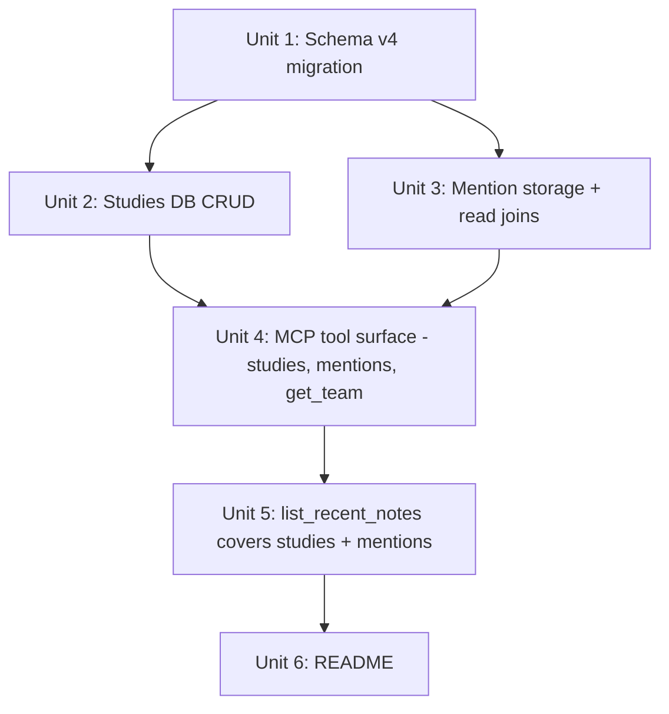

# feat: Studies (research containers) and note mentions

## Overview

Add a third note subject — **studies**, named research containers with `open`/`archived` status — and a many-to-many **mentions** relation so any note can tag the players and teams it references. From a player or team view, the user sees both notes *about* them and notes that *mention* them, in two distinct lists.

## Problem Frame

Notes today live under exactly one subject (player or team). Long-running research ("RB handcuffs to target") has nowhere natural to live, and a single note that talks about three entities is only discoverable from one of them. Studies + mentions fix both gaps without inventing a new note concept (see origin: `docs/brainstorms/2026-04-26-studies-and-mentions-requirements.md`).

## Requirements Trace

- **R1, R2, R3, R4, R5** — studies as a third subject with status, full CRUD, archive/unarchive, cascade-delete. Advanced by Units 1, 2, 4.
- **R6, R7, R8** — explicit mentions on every note, validated at write, surfaced on read. Advanced by Units 1, 3, 4.
- **R9, R10, R11** — `get_player` / new `get_team` return two lists (notes + mentions); existing `list_notes` / `list_team_notes` unchanged. Advanced by Unit 4.
- **R12** — `list_recent_notes` covers studies and includes mentions on each entry. Advanced by Unit 5.

## Scope Boundaries

- No automatic mention extraction from note text — mentions are explicit.
- No multi-subject notes; cross-references happen via mentions.
- No nested studies, no full-text search, no arbitrary tags.
- No backfill of mentions for notes already in the DB — they exist with empty mention sets.

## Context & Research

### Relevant Code and Patterns

- `src/ffpresnap/db.py`
  - `SCHEMA_VERSION` + `_migrate` — established pattern for additive schema bumps. v2→v3 already does an in-place table rebuild for the polymorphic notes CHECK constraint; v3→v4 follows the same shape.
  - `_note_row`, `_team_row`, `_player_row` — row-builder helpers; mention-bearing reads need their own helper that joins through the mentions tables.
  - `add_team_note` / `list_team_notes` — show the pattern of validating a team identifier via `get_team` and using its `abbr` as the canonical id; study tools mirror this (validate via `get_study(study_id)`).
  - `replace_players` — already does manual cascade now that notes are polymorphic; deleting a study will follow the same explicit-delete pattern.
- `src/ffpresnap/server.py`
  - Declarative `TOOLS` list + `handle_tool_call` dispatch. Adding tools is purely additive: append schemas and one `if name == ...` branch each.
  - `AmbiguousTeamError` and `NotFoundError` mapping to `ToolError` is the established surface for user-facing failures.
- `tests/test_db.py`, `tests/test_server.py` — `db` fixture pattern, raises-based error checks, end-to-end agent flow tests. New tests follow the same shape; the `synced_db` fixture in `test_server.py` is already useful for mention tests because it has both KC and BUF players.

### Institutional Learnings

- `docs/solutions/` is not present in this repo. None to import.

### External References

- None needed. SQLite CHECK-constraint changes require the rename-create-copy-drop dance; v2→v3 in this same repo is the working reference.

## Key Technical Decisions

- **Studies are a third `subject_type` value, not a parallel concept.** Notes already work uniformly across player/team via `subject_type` + `subject_id`; adding `study` keeps the model uniform and lets `list_recent_notes` work without special cases. (Confirms origin Key Decision.)
- **Studies use an integer surrogate `id`, not a string slug.** Matches `notes.id` style and avoids slug-collision logic. Tools accept `study_id: integer`.
- **Mentions live in two purpose-built tables, not one polymorphic mentions table.**
  - `note_player_mentions(note_id, player_id, PRIMARY KEY(note_id, player_id))`
  - `note_team_mentions(note_id, team_abbr, PRIMARY KEY(note_id, team_abbr))`
  - Each has a real FK to its target. Trade-off considered: a single `note_mentions(note_id, target_type, target_id)` table is simpler structurally but loses the FK and forces every read to filter by `target_type`. With only two target types, two narrow tables read more naturally and keep referential integrity tight.
- **Mention input shape: parallel arrays.** Tools accept `mentions: { player_ids: ["4046"], team_abbrs: ["KC"] }`. Rationale: Claude already knows the type when it's writing the call; an array-of-tagged-objects (`[{type, id}, ...]`) is more LLM-friendly when the type is unknown, but here it's never unknown. Parallel arrays are also easier to validate with two batch lookups.
- **Update semantics for mentions: full replace.** When a note is updated with a `mentions` argument, the stored mention set is replaced wholesale. Omitting `mentions` from an update leaves them untouched. Rationale: simpler invariant, idempotent retries, matches the way `replace_players` already thinks about state.
- **Three typed `add_*_note` tools, not one unified tool.** Existing surface already has `add_note` (player) and `add_team_note`; adding `add_study_note` keeps the pattern. The internal DB layer can share a private `_add_note(subject_type, subject_id, body, mentions)` helper. (Resolves origin deferred question.)
- **Mention validation rejects the entire write when any mention is invalid.** No partial writes — wraps the insert in a transaction and rolls back on any unknown player_id / unresolvable team. Rationale: we already validate similarly in `replace_players` (entire batch fails on one bad row) and the agent gets a clean error message.
- **Team mentions store the canonical abbreviation.** Tool input accepts the same permissive identifier `get_depth_chart` accepts (abbr / full name / nickname); the DB layer resolves each via `get_team` to a canonical `abbr` before storing.
- **Schema v3 → v4 migration is additive plus a notes-table rebuild.** Rebuild is required to extend the `subject_type` CHECK to include `'study'` (SQLite limitation). Existing rows and ids are preserved. Mentions tables are created empty.

## Open Questions

### Resolved During Planning

- _Mention input shape?_ → Parallel arrays: `{ player_ids: [...], team_abbrs: [...] }`.
- _Update semantics for mentions?_ → Full replace when `mentions` is provided; left alone when omitted.
- _`get_team` shape?_ → New tool, payload is `{ team, notes, mentions }` mirroring `get_player`.
- _Typed vs unified `add_note`?_ → Three typed tools (`add_note`, `add_team_note`, `add_study_note`), each accepting an optional `mentions` arg; shared `_add_note` helper underneath.
- _One mentions table or two?_ → Two purpose-built tables, one per target type, each with a real FK.
- _Validation behavior?_ → Atomic — one bad mention rejects the whole note write.

### Deferred to Implementation

- Final exact JSON shape of the `mention` block on returned notes — likely `{ players: [{player_id, full_name, team, position}], teams: [{abbr, full_name}] }`, but the columns to project are easier to lock in once the join queries are written.
- Whether `update_study(status="archived")` and the convenience tools `archive_study` / `unarchive_study` should both exist or just one path. Both is fine; pick during implementation based on how the agent ergonomics feel after the first end-to-end test.
- Index on `notes(subject_type, subject_id, created_at DESC)` is already present from v3. Verify it covers the new `subject_type='study'` reads or add a study-specific index if `EXPLAIN QUERY PLAN` shows a scan.

## High-Level Technical Design

> *This illustrates the intended approach and is directional guidance for review, not implementation specification. The implementing agent should treat it as context, not code to reproduce.*

```
Subjects                 Notes (polymorphic)              Mentions
                                                          (M:N tags)
┌──────────┐
│ players  │◀──── subject_type='player' ─────┐
└──────────┘                                  │
                                              │      ┌──────────────────────┐
┌──────────┐                                  ├──── │ note_player_mentions │──▶ players
│ teams    │◀──── subject_type='team'   ──────┤      │ (note_id, player_id) │
└──────────┘                                  │      └──────────────────────┘
                                              │
┌──────────┐                                  │      ┌──────────────────────┐
│ studies  │◀──── subject_type='study'  ──────┘      │ note_team_mentions   │──▶ teams
│ (new)    │                                         │ (note_id, team_abbr) │
└──────────┘                                         └──────────────────────┘

Read shapes:
  get_player(player_id)
    → notes:    notes WHERE subject_type='player' AND subject_id=?
    → mentions: notes WHERE id IN (SELECT note_id FROM note_player_mentions WHERE player_id=?)
                AND NOT (subject_type='player' AND subject_id=?)   -- exclude self

  get_team(team)  /  get_study(study_id)  follow the same shape.

  Every note returned by any tool carries:
    mentions: { players: [{player_id, full_name, team, position}],
                teams:   [{abbr, full_name}] }
```

## Implementation Units



- [ ] **Unit 1: Schema v4 — studies table, mentions tables, CHECK rebuild**

**Goal:** Bump `SCHEMA_VERSION` to 4. Add `studies`, `note_player_mentions`, `note_team_mentions`. Rebuild `notes` to extend its `subject_type` CHECK to include `'study'`. Existing data is preserved.

**Requirements:** R1, R6 (storage layer)

**Dependencies:** None.

**Files:**
- Modify: `src/ffpresnap/db.py` (SCHEMA_V2 → keep but treat as base; add SCHEMA_V4 fragment / inline scripts in `_migrate`; bump SCHEMA_VERSION)
- Modify: `tests/test_db.py`

**Approach:**
- New `studies(id INTEGER PK AUTOINCREMENT, title TEXT NOT NULL, description TEXT, status TEXT NOT NULL CHECK (status IN ('open', 'archived')), created_at TEXT NOT NULL, updated_at TEXT NOT NULL)`. Index on `(status, updated_at DESC)` so the default `list_studies` (open, newest first) is fast.
- New `note_player_mentions(note_id INTEGER NOT NULL REFERENCES notes(id) ON DELETE CASCADE, player_id TEXT NOT NULL REFERENCES players(player_id) ON DELETE CASCADE, PRIMARY KEY(note_id, player_id))`. Index on `player_id`.
- New `note_team_mentions(note_id INTEGER NOT NULL REFERENCES notes(id) ON DELETE CASCADE, team_abbr TEXT NOT NULL REFERENCES teams(abbr), PRIMARY KEY(note_id, team_abbr))`. Index on `team_abbr`. (No cascade from teams since teams are hardcoded and never deleted.)
- v3→v4 migration: rename `notes` to `notes_v3`, recreate `notes` with the new CHECK that allows `'study'`, copy rows over preserving `id`, drop `notes_v3`, recreate the index. Then create the new tables.
- Naming inside the migration follows the v2→v3 convention already in `_migrate`.
- `replace_players` no longer needs to manually delete `notes` for removed players — the FK cascade on `note_player_mentions` already handles itself, and the existing manual `DELETE FROM notes ... subject_type='player'` still cleans the parent rows. Confirm cascade order during testing.

**Patterns to follow:**
- Existing `_migrate` v2→v3 branch (rename → create → INSERT … SELECT → drop).

**Test scenarios:**
- Happy path: opening a fresh DB at v4 has all four new structures (`studies`, `note_player_mentions`, `note_team_mentions`, and the rebuilt `notes`); `schema_version = 4`.
- Edge case: opening an existing v3 DB upgrades to v4 in place. Existing player and team notes survive intact (same `id`, `body`, `subject_type`, `subject_id`, timestamps).
- Edge case: opening a v4 DB does not re-run the rebuild (idempotent open).
- Error path: inserting a note with `subject_type='study'` succeeds at v4; same insert at v3 would have failed the CHECK. (Sanity check that the CHECK was actually relaxed.)
- Edge case: deleting a note cascades to `note_player_mentions` and `note_team_mentions` rows for that note.
- Edge case: deleting a player cascades to `note_player_mentions` rows for that player.

**Verification:**
- `tests/test_db.py` migration tests pass; SQLite `PRAGMA table_info(notes)` reflects the new CHECK; FK enforcement is observable.

---

- [ ] **Unit 2: Studies DB CRUD**

**Goal:** Database methods for creating, listing, getting, updating, archiving/unarchiving, and deleting studies. Notes attach via the existing polymorphic shape with `subject_type='study'`.

**Requirements:** R1, R2, R3, R4, R5

**Dependencies:** Unit 1.

**Files:**
- Modify: `src/ffpresnap/db.py`
- Modify: `tests/test_db.py`

**Approach:**
- Methods (signatures are illustrative — exact final shapes land in code):
  - `create_study(title: str, description: str | None = None) -> dict` — defaults `status='open'`, sets timestamps.
  - `get_study(study_id: int) -> dict` — raises `NotFoundError` on miss.
  - `list_studies(status: str | None = 'open') -> list[dict]` — `'open'` (default), `'archived'`, or `None` for all. Ordered by `updated_at DESC`.
  - `update_study(study_id, title=None, description=None) -> dict` — partial update; touches `updated_at`. Does not change status.
  - `set_study_status(study_id, status: str) -> dict` — single path used by archive/unarchive convenience tools.
  - `delete_study(study_id) -> None` — explicit DELETE on `notes WHERE subject_type='study' AND subject_id=?` (the FK cascade is from notes to mentions, not from studies to notes), then DELETE on `studies`. Wrap in a transaction.
  - `add_study_note(study_id, body, mentions=None) -> dict` — validates the study, delegates to the shared `_add_note` helper introduced in Unit 3 with `subject_type='study'` and `subject_id=str(study_id)`.
  - `list_study_notes(study_id) -> list[dict]` — primary-subject notes for the study (mirrors `list_notes` / `list_team_notes`).
- `_study_row(row) -> dict` row builder, mirroring the existing `_team_row` / `_note_row` helpers.

**Patterns to follow:**
- `add_team_note` / `list_team_notes` for the validate-then-delegate shape.
- `replace_players` for the explicit-cascade-then-delete pattern in `delete_study`.

**Test scenarios:**
- Happy path: `create_study(title, description)` returns a row with status `'open'`, both timestamps set, `id` > 0.
- Happy path: `list_studies()` defaults to status `'open'`; archived studies hide unless requested.
- Happy path: `set_study_status(id, 'archived')` then `list_studies(status='archived')` returns it; default `list_studies()` excludes it.
- Happy path: `update_study(id, title=...)` updates only the named field and bumps `updated_at`; passing nothing is a no-op.
- Error path: `get_study`, `update_study`, `set_study_status`, `delete_study` raise `NotFoundError` for an unknown id.
- Error path: invalid status (`'closed'`) raises a clear error (CHECK constraint surfaces).
- Happy path: `add_study_note` then `list_study_notes` round-trips; notes are newest first.
- Happy path: `delete_study` cascades — its notes are gone, mentions for those notes are gone (via the note→mentions FK cascade from Unit 1).
- Edge case: `delete_study` on a study with zero notes still succeeds.
- Integration: notes from a deleted study no longer appear in `list_recent_notes` (covered in Unit 5; reference here for traceability).

**Verification:**
- All study DB tests pass; manual SQL inspection shows orphan-free state after delete.

---

- [ ] **Unit 3: Mention storage and read joins**

**Goal:** Internal helpers that validate, write, and read mentions. Underpins every note-bearing path (player, team, study).

**Requirements:** R6, R7, R8

**Dependencies:** Unit 1.

**Execution note:** Implement the validation paths test-first — invalid-mention scenarios are the highest-risk surface and the failure mode is data leakage if validation isn't tight.

**Files:**
- Modify: `src/ffpresnap/db.py`
- Modify: `tests/test_db.py`

**Approach:**
- Refactor the existing `_add_note(subject_type, subject_id, body)` private helper to accept `mentions: dict | None`. When provided, it:
  1. Validates each `player_ids` entry exists in `players` (single `SELECT … WHERE player_id IN (…)` and compare counts; raise `NotFoundError` listing the unknown ids).
  2. Resolves each `team_abbrs` entry through `get_team` (accepts abbr / full name / nickname); collects canonical abbrs. Ambiguous or unknown raises before any write.
  3. Wraps the note insert and mention inserts in a single transaction.
- Add `_replace_mentions(note_id, mentions)` for the update path. Deletes existing `note_player_mentions` and `note_team_mentions` rows for the note, then inserts the new set, atomically. Used by `update_note` when `mentions` is provided.
- Add `_load_mentions_for(note_ids: list[int]) -> dict[int, dict]` — single batched read returning, per note id, `{ players: [...], teams: [...] }` with the projected fields (`{player_id, full_name, team, position}` for players; `{abbr, full_name}` for teams). Used by every note-returning method.
- Update `_note_row` (or add a sibling `_note_row_with_mentions`) so the mention block is attached to each returned note. Keep both versions if some hot paths don't need it; otherwise unify.
- Update `update_note(note_id, body, mentions=None)`: when `mentions` is provided, call `_replace_mentions`; when omitted, leave existing mentions alone. Both note types (player, team, study) share this single `update_note`.

**Patterns to follow:**
- Transaction shape from `replace_players` (`BEGIN`, batch operations, commit; rollback on error).
- Existing FK-cascade reliance for note-to-mentions cleanup on note delete.

**Test scenarios:**
- Happy path: `add_note(player_id, body, mentions={"player_ids": [...], "team_abbrs": [...]})` stores the mentions and `_load_mentions_for([note_id])` returns them with full projections.
- Happy path: team identifier resolution — passing `'Chiefs'` resolves to `'KC'` in stored `note_team_mentions.team_abbr`.
- Happy path: empty mention lists (or omitted `mentions`) store nothing.
- Error path: an unknown `player_id` in `mentions.player_ids` raises `NotFoundError` and the note row is **not** persisted (verify by listing notes after the failure).
- Error path: an unknown team in `mentions.team_abbrs` raises and the note row is not persisted.
- Error path: an ambiguous team identifier in mentions raises `AmbiguousTeamError`.
- Edge case: duplicate ids in input (`["4046", "4046"]`) — dedupe before insert so the PK constraint doesn't fire; verify only one stored row.
- Happy path: `update_note(note_id, body, mentions={...})` replaces the prior mention set (old removed, new inserted).
- Edge case: `update_note(note_id, body)` (no `mentions` arg) leaves existing mentions untouched.
- Edge case: `update_note(note_id, body, mentions={"player_ids": [], "team_abbrs": []})` is the "clear all" form and removes all mentions.
- Integration: deleting a note cascades to its mention rows (Unit 1 covers the cascade itself; this verifies the integration through the public API).
- Integration: deleting a player cascades and removes all `note_player_mentions` for that player; the parent notes survive but no longer mention them. Verify via `_load_mentions_for`.

**Verification:**
- All tests pass; failure-path tests confirm zero partial writes.

---

- [ ] **Unit 4: MCP tool surface — studies, mentions, get_team**

**Goal:** Wire the new DB capabilities through the MCP tool list. Add study tools, accept `mentions` on every `add_*_note` and on `update_note`, surface mentions on every read, add `get_team`, and extend `get_player` with the dual-list shape.

**Requirements:** R2, R6, R8, R9, R10, R11

**Dependencies:** Units 2 and 3.

**Files:**
- Modify: `src/ffpresnap/server.py`
- Modify: `tests/test_server.py`

**Approach:**
- Add tools (each is a thin handler over a `Database` method):
  - `create_study({ title, description? })`
  - `list_studies({ status? })` — `status` is `"open"` (default), `"archived"`, or `"all"`.
  - `get_study({ study_id })` — returns `{ study, notes, mentions }`.
  - `update_study({ study_id, title?, description? })`
  - `archive_study({ study_id })` / `unarchive_study({ study_id })` — convenience over `set_study_status`.
  - `delete_study({ study_id })`
  - `add_study_note({ study_id, body, mentions? })`
  - `list_study_notes({ study_id })` — primary-subject notes only, mirrors `list_notes`.
  - `get_team({ team })` — new tool; returns `{ team, notes, mentions }`.
- Modify existing tools:
  - `add_note` and `add_team_note` accept optional `mentions: { player_ids?: string[], team_abbrs?: string[] }`.
  - `update_note` accepts optional `mentions` (replace semantics; omitted = unchanged).
  - `get_player` returns `{ player, notes, mentions }` (was `{ player, notes }`). Existing payload field `notes` keeps its meaning (primary-subject notes); `mentions` is the new list.
  - Every list/get endpoint that returns notes includes the `mentions` block on each note (the shape from Unit 3's `_load_mentions_for`).
- Error mapping:
  - `NotFoundError` (unknown player/team/study/study_id) → `ToolError`.
  - `AmbiguousTeamError` (in mentions or in `team` argument) → `ToolError` listing candidates, same as `get_depth_chart` already does.
- Removed tools: none. Existing surface is preserved.

**Patterns to follow:**
- Existing `TOOLS` list and `handle_tool_call` dispatch — one schema entry, one `if name == ...` branch each.
- `get_depth_chart`'s ambiguous-team error formatting.

**Test scenarios:**
- Happy path: `create_study` then `list_studies` returns it under default `open` status.
- Happy path: `archive_study` then `list_studies` (default) excludes it; `list_studies({status: "archived"})` includes it; `list_studies({status: "all"})` includes both.
- Happy path: `add_study_note` then `get_study` returns `notes` newest-first; `mentions` lists notes elsewhere that tag the study (initially empty until cross-references exist — currently studies aren't a mention target, so `mentions` for a study is always empty in this iteration; verify the field is present and `[]`).
- Happy path: `delete_study` removes the study and its notes; `get_study` then raises `ToolError`.
- Happy path: `add_note(player_id="4046", body="...", mentions={"team_abbrs": ["BUF"], "player_ids": ["4034"]})` stores mentions; `get_player(player_id="4034")` returns the new note under `mentions` (not under `notes`).
- Happy path: `get_team(team="Chiefs")` returns `{ team: {...}, notes: [...], mentions: [...] }`.
- Happy path: `update_note(note_id, body, mentions={"player_ids": [], "team_abbrs": []})` clears the mention set.
- Edge case: `update_note(note_id, body)` (no `mentions`) does not change mentions.
- Error path: `add_team_note(team="Foobar", body="x")` still raises (existing behavior); plus `mentions` containing an unknown player raises and the note is not written.
- Error path: ambiguous team in `mentions.team_abbrs` raises `ToolError` listing candidates.
- Error path: `add_study_note` with an unknown `study_id` raises.
- Integration (end-to-end agent flow): user creates a study → adds notes mentioning multiple players and a team → opens a player and sees the note under `mentions` while the player's own notes stay separate → archives the study → `list_studies` no longer shows it but `get_study` still works.

**Verification:**
- All server tests pass; restarting the live MCP and listing tools shows the new entries.

---

- [ ] **Unit 5: list_recent_notes covers studies and mentions**

**Goal:** The cross-subject feed includes study notes and surfaces mentions on every entry.

**Requirements:** R12

**Dependencies:** Unit 4.

**Files:**
- Modify: `src/ffpresnap/db.py` (extend `list_recent_notes`)
- Modify: `src/ffpresnap/server.py` (no schema change to the tool — still `list_recent_notes({ limit? })`)
- Modify: `tests/test_db.py`, `tests/test_server.py`

**Approach:**
- Extend the existing `list_recent_notes` SQL to LEFT JOIN against `studies` for the `subject_type='study'` case, projecting `study.title` (and `study.status`) into the subject block.
- Subject block for study notes: `{ "type": "study", "study_id": <int>, "title": "...", "status": "open"|"archived" }`.
- After fetching the rows, batch-load mentions via `_load_mentions_for([row.id for row in rows])` and attach the `mentions` block to each entry.
- Preserve existing behavior for player and team subject blocks; just add `mentions` to each entry.

**Patterns to follow:**
- Existing `list_recent_notes` LEFT JOIN structure for player + team is the template.

**Test scenarios:**
- Happy path: a feed with one player note, one team note, and one study note returns all three with correct `subject.type` values, newest first.
- Happy path: a study note's subject block carries `study_id`, `title`, and `status`.
- Happy path: notes with mentions return them in the `mentions` block on each entry; notes without mentions return `{ players: [], teams: [] }` (empty but present).
- Edge case: archived studies still appear in the feed (the feed shows what was written, not what's currently active).
- Edge case: clamp limits (already covered) still apply.

**Verification:**
- Tests pass; running `list_recent_notes` against a populated DB returns a payload the agent can render without follow-up calls.

---

- [ ] **Unit 6: README**

**Goal:** Document the new tool surface and the studies + mentions concepts.

**Requirements:** Supports R2, R6, R8 (user-visible docs).

**Dependencies:** Unit 5.

**Files:**
- Modify: `README.md`

**Approach:**
- Add a "Studies" section under Tools listing `create_study`, `list_studies`, `get_study`, `update_study`, `archive_study`, `unarchive_study`, `delete_study`, `add_study_note`, `list_study_notes`.
- Add a one-paragraph "Mentions" subsection under Notes explaining that any `add_*_note` and `update_note` accepts an optional `mentions: { player_ids, team_abbrs }`, and that `get_player` / `get_team` / `get_study` surface a `mentions` list of notes that tag this subject.
- Add `get_team` to the Browse list.
- Note the schema v3 → v4 in-place upgrade: existing notes are preserved; mention lists start empty.

**Patterns to follow:**
- Existing terse README tone.

**Test scenarios:**
- Test expectation: none — documentation only, no behavior change.

**Verification:**
- README accurately lists every tool currently in `server.TOOLS` and the install/sync flow still runs cleanly.

## System-Wide Impact

- **Interaction graph:** `get_player` and `list_recent_notes` change shape (additive: new keys, no removed keys). Existing callers — Claude Desktop / Claude Code — gracefully ignore the new fields, but the agent's prompt context for "player view" now includes mentions, which it should learn to use.
- **Error propagation:** Mention validation is the new failure surface. A single bad mention rolls back the whole note write — `add_*_note` and `update_note` may now fail where they previously couldn't. The server maps `NotFoundError` and `AmbiguousTeamError` to `ToolError` with clear messages.
- **State lifecycle risks:**
  - The v3→v4 notes-table rebuild is destructive in form (drop and recreate). The migration test must verify no data loss.
  - Mentions cascade-delete with their parent note (FK). Notes cascade-delete with their player (existing manual cascade in `replace_players`) — mention rows go with them via the new FK on `note_player_mentions`. Verify this chain end-to-end.
  - `delete_study` must explicitly delete its notes before the study row (no FK from notes to studies; `subject_id` is opaque).
- **API surface parity:** `get_player`, `get_team` (new), and `get_study` all return `{ <subject>, notes, mentions }`. Keep them aligned. `list_recent_notes` includes `mentions` on every entry.
- **Integration coverage:** End-to-end test in `test_server.py` should exercise: create study → add note with mentions → open mentioned player → verify mention appears under `mentions` (not `notes`) → archive study → confirm filtering.
- **Unchanged invariants:**
  - Sleeper sync (`replace_players`), team seeding, depth-chart query semantics, and existing tools (`list_notes`, `list_team_notes`, `update_note`, `delete_note`) keep their current behavior. `update_note` adds an optional argument but the no-args call path is unchanged.
  - Notes still have exactly one primary subject.

## Risks & Dependencies

| Risk | Mitigation |
|------|------------|
| v3→v4 notes rebuild loses data on partial failure. | Wrap the rebuild in a transaction; cover with a migration test that opens a fresh v3 DB containing real notes and verifies row-by-row preservation. |
| Mention validation fails open (silently stores invalid mentions). | Test-first execution note on Unit 3; explicit error-path tests for unknown player_id, unknown team, ambiguous team, and verify the note row is not persisted on any of them. |
| `_load_mentions_for` becomes an N+1 hot spot when feeds get large. | Batch-load by `note_id IN (...)` once per call; verify `EXPLAIN QUERY PLAN` uses the indexes from Unit 1 during test or a one-off check. The default `list_recent_notes` limit is already 50 (max 200), bounding worst case. |
| Agent forgets to pass `mentions`, regressing cross-references silently. | Tool descriptions explicitly state mentions are explicit and important; a follow-up could add a system prompt nudge but isn't in scope here. |
| `delete_study` orphans notes if the explicit delete is forgotten. | Wrap study deletion in a transaction that always deletes notes first; a test verifies no `subject_type='study' AND subject_id=<deleted-id>` rows remain. |
| Adding `mentions` to `update_note` breaks an existing call site. | Keep `mentions` strictly optional; explicit test confirms the no-`mentions` path leaves stored mentions unchanged. |

## Documentation / Operational Notes

- README updated in Unit 6.
- No telemetry, no rollout flags. Single-user local install — upgrade path is `pip install -e .` then re-launch the MCP client to re-load the tool list.
- After upgrade, existing player and team notes have empty mention lists. The user can backfill by re-saving notes through `update_note(note_id, body, mentions={...})` if desired; not required.

## Sources & References

- **Origin document:** [docs/brainstorms/2026-04-26-studies-and-mentions-requirements.md](../brainstorms/2026-04-26-studies-and-mentions-requirements.md)
- Related code:
  - `src/ffpresnap/db.py` — `_migrate` (v2→v3 rebuild pattern), `replace_players` (transactional cascade pattern), `_add_note` (current private helper to refactor), `list_recent_notes` (LEFT JOIN feed pattern).
  - `src/ffpresnap/server.py` — `TOOLS` declaration and `handle_tool_call` dispatch.
  - `tests/test_db.py`, `tests/test_server.py` — `db` and `synced_db` fixture patterns; v1→v2 and v2→v3 migration tests as templates.
- Prior plan: [docs/plans/2026-04-26-001-feat-sleeper-sync-and-team-depth-chart-plan.md](2026-04-26-001-feat-sleeper-sync-and-team-depth-chart-plan.md) (status: completed) — established schema migration and tool-surface conventions this plan extends.
