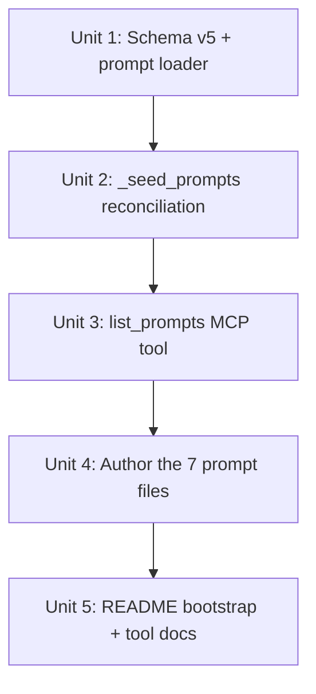

# feat: Prompt library + onboarding artifact

## Overview

Add a curated, repo-shipped catalog of canned prompts that direct Claude to build specific dashboard artifacts (study browser, depth-chart explorer, note-recency feed, player card, team overview, mention graph, plus a self-referential "show prompt library"). Each prompt is a separate front-mattered markdown file inside the package. On every `Database.open()` the prompt set is reconciled into a new `prompts` table. A single new MCP tool, `list_prompts`, returns the catalog so Claude can render it as a copy-button artifact. The README adds a "Getting started" section with a copy-pasteable bootstrap prompt that triggers the artifact.

## Problem Frame

A new user installs ffpresnap, connects the MCP, and faces a cold start: the value is in the dashboards Claude can build *if* the user knows what to ask for. We hand them a one-paste menu (see origin: `docs/brainstorms/2026-04-27-prompt-library-and-onboarding-artifact-requirements.md`).

## Requirements Trace

- **R1, R2** — prompts authored as repo files, reconciled into DB on every open. Advanced by Units 1, 2.
- **R3** — schema: `slug`, `title`, `description`, `body`. Advanced by Unit 1.
- **R4, R5** — single read-only MCP tool. Advanced by Unit 3.
- **R6, R7** — README bootstrap + self-referential `show-prompt-library` entry. Advanced by Units 4 (the entry) and 5 (the README).
- **R8** — ship 7 named prompts. Advanced by Unit 4.
- **R9, R10** — prompt-body conventions (self-contained, tool-name-referenced, no live data). Advanced by Unit 4.

## Scope Boundaries

- No prompt-mutation tools (no `add_prompt` / `delete_prompt`).
- No user-defined prompts in v1 — repo is sole source.
- No telemetry on prompt usage.
- No new MCP tool capabilities — every prompt body uses the existing 18-tool surface as-is.
- No dashboards committed as code — the prompts produce dashboards on-the-fly via Claude artifacts.
- No prompt versioning or slug-rename migration — rename = remove + insert.

## Context & Research

### Relevant Code and Patterns

- `src/ffpresnap/teams.py` + `Database._seed_teams` (`src/ffpresnap/db.py`) — exact template for repo-shipped static data reconciled on open. `INSERT OR IGNORE` today; the prompts seed needs full upsert+delete for "repo as source of truth."
- `Database._migrate` (`src/ffpresnap/db.py`) — established schema-version-bump pattern. v4→v5 is purely additive (new table, no notes rebuild) so the v3→v4 ladder doesn't need extension; just add a `current < 5` arm that creates the `prompts` table.
- `SCHEMA_V2` constant in `db.py` — already executed at the bottom of `_migrate` for "ensure peer tables exist." Adding the `prompts` table here makes it idempotent and self-healing on partial DBs.
- `src/ffpresnap/server.py` `TOOLS` declaration + `handle_tool_call` dispatch — adding a tool is one schema entry + one `if name == ...` branch.
- `tests/test_db.py` v2→v3 / v3→v4 migration tests — direct templates for v4→v5 migration coverage.
- Repo doc convention — every brainstorm and plan file is front-mattered markdown. Mirroring that for prompt files is consistent and editor-friendly.

### Institutional Learnings

- `docs/solutions/` not present. None to import.

### External References

- None needed. Python stdlib (`importlib.resources`) ships package data files cleanly with `pip install -e .`.

## Key Technical Decisions

- **One prompt per front-mattered markdown file in `src/ffpresnap/prompts/`.** Bodies are 20–80 lines of mixed instructions and structure; Python triple-quoted strings would obscure them and complicate diffs. Front-mattered markdown matches the existing doc convention, makes PRs that add a prompt a one-file change, and parses with a ~15-line splitter (no new dependency). Files are inside the package directory so `importlib.resources` packages them automatically.
- **Frontmatter is plain key-value lines (`key: value`), not YAML or TOML.** The schema is exactly three fields (`slug`, `title`, `description`). No nesting, no lists. A 5-line parser beats adding a dep or invoking `tomllib` for a flat key-value pair.
- **Reconciliation runs on every `Database.open()`.** Mirrors the teams seed. Cheap: read 7 small files, batch upsert. Compute a diff (slugs in repo vs slugs in DB), insert/update changed rows, delete repo-removed slugs — all in one transaction.
- **`prompts` table uses `slug TEXT PRIMARY KEY`, not an integer surrogate.** Slug is the stable identifier referenced by the README and library entry. There's no separate human-friendly id to coexist with.
- **Schema v5 migration is purely additive — no notes/players rebuild.** Just create the `prompts` table. The existing `_migrate` ladder already calls `executescript(SCHEMA_V2)` after every migration arm, so adding the table to `SCHEMA_V2` makes new DBs and upgraded DBs reach v5 the same way.
- **Tool name: `list_prompts`.** Brainstorm called the *concept* "prompt library"; the tool name follows the established `list_*` convention to match `list_studies`, `list_teams`, `list_players`, `list_notes`. Tool count goes from 18 to 19.
- **`list_prompts` returns the full set, no pagination, no `get_prompt(slug)`.** With 7 entries (and a soft cap of ~30 before we'd revisit), the entire payload is small enough to ship in one tool call. Pagination and lookup tools are YAGNI.
- **Prompts loader uses `importlib.resources.files(...).iterdir()`.** Robust to running from source, from an installed wheel, or from an editable install. No filesystem path assumptions.
- **Each prompt body is markdown-flavored prose, not JSON or template DSL.** The agent (Claude) reads the body verbatim as instructions. Bodies should explicitly note the Claude-artifact pattern: call MCP tool(s) → embed the JSON result into the artifact source → render with the specified layout. Live-streaming UIs are not the model.
- **Self-referential `show-prompt-library` entry exists in the catalog.** Body is the same bootstrap text as the README's "Getting started" block, so re-summoning the artifact is a copy-button click after the first install.

## Open Questions

### Resolved During Planning

- _File format?_ → Front-mattered markdown, one file per prompt.
- _Directory location?_ → `src/ffpresnap/prompts/` (inside the Python package).
- _Reconciliation timing?_ → Every `Database.open()`, after `_seed_teams()`.
- _Frontmatter parser?_ → Tiny custom parser for `key: value` lines; no YAML/TOML dep.
- _Tool name?_ → `list_prompts` (consistency with existing `list_*` convention; concept name "prompt library" stays in user-facing copy).
- _`get_prompt(slug)` companion?_ → No. Single-tool surface; revisit if catalog passes ~30 entries.

### Deferred to Implementation

- Final wording of each prompt body. Each is editorial: write the substantive instruction, paste into Claude, observe the rendered artifact, iterate. Plan provides the per-prompt skeleton (tool to call, expected payload shape, target UX); implementation fills in voice and detail.
- Whether `list_prompts` needs an explicit ordering argument. Default: stable order (alphabetical by `slug`, with `show-prompt-library` first via a small sort key). Revisit after seeing the artifact rendered.
- The exact bootstrap-prompt wording in the README (and identically in the `show-prompt-library` body). Implementation drafts; tweak after first end-to-end test.

## High-Level Technical Design

> *This illustrates the intended approach and is directional guidance for review, not implementation specification. The implementing agent should treat it as context, not code to reproduce.*

```
src/ffpresnap/prompts/                    Repo (source of truth)
├── show-prompt-library.md
├── study-browser.md
├── depth-chart-explorer.md
├── note-recency-feed.md
├── player-card.md
├── team-overview.md
└── mention-graph.md

  Each file:
  ---
  slug: study-browser
  title: Study Browser
  description: Browse studies and drill into their notes.
  ---
  Build me a study browser as an interactive Claude artifact.
  Step 1: Call list_studies (no args).
  Step 2: For each study, render a card showing title, description, ...
  ...

                          │ Database.open()
                          ▼
   ┌──────────────────────────────────────┐
   │ prompts loader (importlib.resources) │
   │   - iterate prompts/*.md             │
   │   - parse frontmatter + body         │
   │   - return list of {slug,title,...}  │
   └──────────────┬───────────────────────┘
                  │
                  ▼
   ┌──────────────────────────────────────┐
   │ Database._seed_prompts()             │
   │   BEGIN                              │
   │     UPSERT each prompt by slug       │
   │     DELETE prompts WHERE slug NOT IN │
   │   COMMIT                             │
   └──────────────┬───────────────────────┘
                  │
                  ▼
   ┌──────────────────────────────────────┐
   │ MCP tool: list_prompts               │
   │   SELECT slug, title, description,   │
   │          body FROM prompts           │
   │   ORDER BY ... (show-prompt-library  │
   │                 first, then alpha)   │
   └──────────────────────────────────────┘
                  │
                  │ tool result (JSON)
                  ▼
   Claude embeds result in an artifact with
   one card per prompt + copy-to-clipboard.
```

## Implementation Units



- [ ] **Unit 1: Schema v5 + prompt-file loader**

**Goal:** Add the `prompts` table at schema v5, extend `_migrate` to upgrade existing DBs, and provide a parser that reads `src/ffpresnap/prompts/*.md` and returns a list of `{slug, title, description, body}` dicts.

**Requirements:** R1, R3 (storage layer)

**Dependencies:** None.

**Files:**
- Modify: `src/ffpresnap/db.py` (bump `SCHEMA_VERSION` to 5; add `prompts` table to `SCHEMA_V2`; add `current < 5` arm to `_migrate`).
- Create: `src/ffpresnap/prompts/__init__.py` (package marker so `importlib.resources` finds the dir).
- Create: `src/ffpresnap/prompt_loader.py` (parser + loader function).
- Create: `tests/test_prompt_loader.py`
- Modify: `tests/test_db.py` (v4→v5 migration test).

**Approach:**
- Schema: `CREATE TABLE IF NOT EXISTS prompts (slug TEXT PRIMARY KEY, title TEXT NOT NULL, description TEXT NOT NULL, body TEXT NOT NULL, updated_at TEXT NOT NULL)`. Append to `SCHEMA_V2`.
- Migration: add `if current < 5:` arm. Body is empty (the table appears via `executescript(SCHEMA_V2)` at the bottom of `_migrate`); the arm exists for symmetry and to make schema-version progression observable in tests.
- Loader: a top-level function `load_prompts() -> list[dict]` that uses `importlib.resources.files("ffpresnap.prompts").iterdir()`, filters to `.md`, and parses each file. Sort the result deterministically — slug-alphabetical, except `show-prompt-library` always first.
- Parser: split the file on the first two `^---$` lines. Frontmatter is a sequence of `key: value` lines; body is everything after the second `---`. Strip leading/trailing whitespace on the body. Validate that `slug`, `title`, and `description` are present and that `slug` matches `^[a-z0-9-]+$` (raise a clear error otherwise — these are repo-shipped files, so a bad one is a developer error, not user input).
- The loader does not touch the DB. It returns plain dicts.

**Patterns to follow:**
- `teams.py` for static-data shape.
- `_migrate` v3→v4 arm for migration-arm style and version-set sequencing.

**Test scenarios:**
- Happy path: a fixture directory with 2 valid prompt files yields exactly 2 dicts with correct field values; `show-prompt-library` slug sorts to position 0 even when other slugs come earlier alphabetically.
- Happy path: opening a fresh DB at v5 has the `prompts` table (verified via `sqlite_master`); `schema_version` is `5`.
- Edge case: a v4 DB upgraded to v5 in place. Existing data (notes, studies, mentions) is untouched; the `prompts` table now exists and is empty.
- Edge case: opening a v5 DB is idempotent — re-running `_migrate` does not raise.
- Edge case: a prompt file with empty body parses successfully (body is empty string).
- Edge case: blank lines and Windows line endings (`\r\n`) inside the file parse correctly.
- Error path: a prompt file missing the closing `---` raises a clear parse error naming the file.
- Error path: a prompt file missing `slug` (or with malformed slug like `Bad Slug!`) raises a clear validation error naming the offending field and file.
- Error path: two files declaring the same `slug` raise — duplicate slugs are unrecoverable for a primary-key seed.

**Verification:**
- `pytest tests/test_prompt_loader.py tests/test_db.py` passes; `PRAGMA table_info(prompts)` shows the four columns + `updated_at`.

---

- [ ] **Unit 2: `_seed_prompts` reconciliation on `Database.open`**

**Goal:** On every `Database` open, sync the loaded prompts into the `prompts` table — upsert each by slug, delete rows whose slug is no longer in the repo. Atomic.

**Requirements:** R1, R2

**Dependencies:** Unit 1.

**Files:**
- Modify: `src/ffpresnap/db.py` (`Database.__init__` calls `_seed_prompts()` after `_seed_teams()`; add the method).
- Modify: `tests/test_db.py`.

**Approach:**
- `_seed_prompts` calls `prompt_loader.load_prompts()` and runs a single transaction:
  1. Upsert each prompt by slug (insert or update title/description/body/updated_at). UPSERT, not delete-and-insert — preserves `slug` as a stable PK.
  2. After upserts, `DELETE FROM prompts WHERE slug NOT IN (...)` to drop repo-removed entries.
- `updated_at` is set on every upsert (always rewritten); we don't track per-field freshness, just "last reconciliation."
- If `load_prompts()` raises (malformed file in repo), `_seed_prompts` propagates the error. Database open fails fast — this is a developer error during PR review, not a runtime concern.
- Inject the loader for tests: `_seed_prompts(loader=load_prompts)` so tests can pass a fixture.

**Patterns to follow:**
- `_seed_teams` for the call sequence.
- `replace_players`'s transactional shape for the upsert + cleanup pair.

**Test scenarios:**
- Happy path: open a fresh DB; the `prompts` table contains exactly the prompts the loader returns. Each row has `slug`, `title`, `description`, `body`, and `updated_at`.
- Happy path: open the DB twice in succession — row count and content unchanged after the second open (idempotent). `updated_at` may be refreshed; that's expected.
- Happy path: simulate a repo update (loader returns one new prompt and omits one previously-shipped slug). After the next open, the new slug exists and the dropped slug is gone.
- Happy path: simulate an edited body (loader returns the same slug with new `body`). After open, the row has the new body.
- Edge case: loader returns an empty list. `_seed_prompts` removes all existing prompt rows and leaves the table empty (no error).
- Error path: loader raises `ValueError`. `Database.open` propagates the error; the DB connection still cleans up (no leaked connection in tests).
- Integration: opening a v4 DB triggers the v4→v5 migration, then `_seed_prompts` fills the new table with the live repo prompts (chained behavior covered end-to-end).

**Verification:**
- All db tests pass; manual smoke against the live DB shows the new prompts table populated after open.

---

- [ ] **Unit 3: `list_prompts` MCP tool**

**Goal:** Surface the catalog through the MCP. Single tool, no args, returns the full list (alphabetical by slug with `show-prompt-library` first).

**Requirements:** R4, R5

**Dependencies:** Unit 2.

**Files:**
- Modify: `src/ffpresnap/server.py` (add to `TOOLS`; add dispatch branch).
- Modify: `src/ffpresnap/db.py` (add `Database.list_prompts() -> list[dict]`).
- Modify: `tests/test_server.py`.

**Approach:**
- DB method: `SELECT slug, title, description, body FROM prompts ORDER BY (CASE slug WHEN 'show-prompt-library' THEN 0 ELSE 1 END), slug`. Return list of dicts.
- Tool entry: `name: "list_prompts"`, no inputSchema properties, description names the purpose ("Return the prompt library — a curated catalog of canned prompts that direct Claude to build dashboard artifacts").
- Dispatch branch: `if name == "list_prompts": return db.list_prompts()`.
- Tool count rises from 18 to 19. README's tool list updated in Unit 5.

**Patterns to follow:**
- `last_sync` as a no-arg tool template.
- `list_teams` for the "list everything in a static catalog" idiom.

**Test scenarios:**
- Happy path: with a fresh DB, `handle_tool_call(db, "list_prompts", {})` returns a non-empty list whose items have all four fields.
- Happy path: `show-prompt-library` is the first item regardless of alphabetical ordering.
- Happy path: items beyond the first are sorted alphabetically by slug.
- Edge case: with an empty `prompts` table (e.g., loader returned no files in a test fixture), the call returns `[]` (does not raise).
- Edge case: tool description and `inputSchema` are well-formed (verified by importing `TOOLS` and asserting structure — small sanity check, not exhaustive).

**Verification:**
- `pytest tests/test_server.py` passes; calling the tool against the live MCP returns 7 entries.

---

- [ ] **Unit 4: Author the 7 prompt files**

**Goal:** Write each of the v1 prompt bodies. Bodies are evergreen instructions referencing the existing 18-tool surface; they tell Claude to call specific tools, embed the JSON result into an artifact, and render with the specified layout.

**Requirements:** R7, R8, R9, R10

**Dependencies:** Unit 3.

**Execution note:** This unit is editorial. After drafting each body, run the bootstrap prompt against the live MCP, observe the rendered artifact, and iterate. Don't try to land all seven in one pass — get one polished, then duplicate the pattern.

**Files:**
- Create: `src/ffpresnap/prompts/show-prompt-library.md`
- Create: `src/ffpresnap/prompts/study-browser.md`
- Create: `src/ffpresnap/prompts/depth-chart-explorer.md`
- Create: `src/ffpresnap/prompts/note-recency-feed.md`
- Create: `src/ffpresnap/prompts/player-card.md`
- Create: `src/ffpresnap/prompts/team-overview.md`
- Create: `src/ffpresnap/prompts/mention-graph.md`

**Approach:**
- Frontmatter for each: `slug`, `title`, `description` (one line, ≤80 chars).
- Body conventions:
  - Open with the dashboard goal in one sentence.
  - List the MCP tool calls Claude should make, with argument shape.
  - Describe the expected JSON shape briefly (so the agent doesn't have to re-derive it).
  - Specify the artifact UI: layout, interactivity, copy-button or refresh affordances.
  - Note explicitly that the artifact embeds the tool-call result as a JSON literal in the artifact source — re-fetching means asking Claude to regenerate, not live-fetching from inside the iframe.
  - End with concrete success criteria (what the user should see).
- Per-prompt skeletons:
  - **show-prompt-library**: call `list_prompts`; render a card grid with title, description, and a copy-to-clipboard button per card. Include a "These re-summon the library:" hint pointing at the `show-prompt-library` card.
  - **study-browser**: call `list_studies(status="open")`; for each study render a card; add a "show archived" toggle (re-prompts Claude to re-run with `status="all"`). Drill-in: clicking a card shows that study's notes via `list_notes(scope="study", target_id=...)`.
  - **depth-chart-explorer**: ask the user for a team identifier; call `get_depth_chart(team=...)`; render groups by `position` with player rows showing name, status, injury_status, depth_chart_order. "Unranked" group last.
  - **note-recency-feed**: call `list_notes(scope="recent", limit=50)`; render a vertical timeline with subject badges (player/team/study), body, mentions list, timestamp. Filter chips for subject type.
  - **player-card**: ask for a player query; call `find_player(query)` if ambiguous else `get_player(player_id)`; render identity + status/injury + bio sections, plus the `notes` and `mentions` lists.
  - **team-overview**: ask for a team identifier; call `get_team(team)` and `get_depth_chart(team)`; render a two-column layout — depth chart on one side, notes + mentions on the other.
  - **mention-graph**: call `list_notes(scope="recent", limit=200)`; collect node set (each note's primary subject + every mention) and edge set (note → each mentioned entity); render with a force-directed or simple SVG layout. Node click shows the mentioning notes.
- Cross-prompt consistency: every body uses the same language for "embed the result as JSON in the artifact source" and "to refresh, ask Claude to regenerate the artifact." Pick the wording in the first prompt and reuse.

**Patterns to follow:**
- The repo's brainstorm/plan files demonstrate the front-mattered-markdown shape.

**Test scenarios:**
- Happy path: every prompt file parses through `prompt_loader.load_prompts()` without error, has all three required frontmatter fields, and a non-empty body.
- Happy path: `list_prompts` returns exactly 7 entries after seeding.
- Edge case: every slug matches `^[a-z0-9-]+$` (covered by the loader test in Unit 1, but confirmed end-to-end here).
- Editorial check (manual, not automated): paste each body into Claude (against the live MCP) and confirm the resulting artifact renders without errors and the dashboard is usable. This is execution-time validation, not a unit test.

**Verification:**
- `pytest` passes (loader tests cover structural correctness). Manual smoke confirms each prompt produces a working artifact.

---

- [ ] **Unit 5: README bootstrap + tool docs**

**Goal:** Add the "Getting started" section with the copy-pasteable bootstrap prompt and document the new tool.

**Requirements:** R6

**Dependencies:** Unit 4 (so the bootstrap text matches the `show-prompt-library` body).

**Files:**
- Modify: `README.md`.

**Approach:**
- Add a "Getting started" section near the top (after install / initial sync) titled "Bootstrap the prompt library." Single fenced code block: the bootstrap prompt — same text as the `show-prompt-library` body. One sentence above explaining "Paste this into Claude after connecting the MCP."
- Add `list_prompts` to the Tools list under a new "Prompt library" subsection (or fold under Browse). Mention that the catalog ships with the package and is reconciled on every open.
- Update the tool-count call-out elsewhere in the README if any (currently there isn't one — verify).

**Patterns to follow:**
- Existing terse README tone; the recently-added "Mentions" section is the right register.

**Test scenarios:**
- Test expectation: none — documentation only, no behavior change.

**Verification:**
- README accurately lists every tool currently in `server.TOOLS`. The bootstrap prompt and the `show-prompt-library` body are textually identical.

## System-Wide Impact

- **Interaction graph:** `Database.__init__` now calls `_seed_prompts()` after `_seed_teams()`. Every place that opens a `Database` (server, CLI sync, every test fixture) will run the loader and reconcile. Loader failures fail-fast at open time.
- **Error propagation:** A malformed prompt file in the repo crashes `Database.open()`. This is intentional — a broken prompt file is a developer mistake we want surfaced loudly during PR review and CI, not silently skipped at runtime. Document this in the loader's docstring.
- **State lifecycle risks:**
  - A user who hand-edits the local `prompts` table will have their changes overwritten on the next open. This is documented in the brainstorm and is the intended trade-off; no mitigation needed.
  - Reconciliation is transactional, but the `updated_at` column rewrites on every open. If anyone ever cares about "when did this prompt last change," they should look at git history, not `updated_at`. Document.
- **API surface parity:** Tool count moves from 18 to 19. No other tools change shape. README must reflect.
- **Integration coverage:** The seeding-on-open path is covered by an end-to-end test that opens a v4 DB and verifies (a) migration succeeded and (b) prompts populated. The MCP tool path is covered separately.
- **Unchanged invariants:**
  - The 18 existing tools keep their current shape and behavior.
  - The `notes`, `players`, `teams`, `studies`, and mention tables are untouched by this change.
  - Sleeper sync (`replace_players`) is untouched.
  - The `Database.open()` semantics — read-current-version, migrate-up — are preserved.

## Risks & Dependencies

| Risk | Mitigation |
|------|------------|
| Malformed prompt file breaks `Database.open()` for everyone after merge. | Loader validation tests cover the bad-file cases; CI runs the test suite. The fail-loud behavior surfaces problems during PR review, not after release. |
| `importlib.resources` behaves differently between editable installs and built wheels. | Use the modern `importlib.resources.files(...).iterdir()` API (Python 3.11+, which the project already requires). Cover both paths via the loader test using a real `src/ffpresnap/prompts/` directory committed to the repo. |
| User edits a prompt locally expecting it to stick, then loses it on next open. | Document explicitly in README that prompts are reconciled from the repo on every open. The brainstorm accepted this trade-off; mitigation is documentation, not behavior. |
| Prompt bodies become stale as the MCP tool surface evolves (e.g., a tool gets renamed). | A tool rename forces re-authoring affected prompts. Cover by adding a section to the project's contribution checklist (out of scope here, but flag in the README). |
| Reconciliation grows expensive if the catalog explodes (>100 prompts). | At 7 entries the cost is microseconds; the soft cap of ~30 from the brainstorm is well within budget. Revisit if/when the catalog approaches 100. |
| The artifact-rendering UX depends on Claude (Desktop / Code) supporting copy-button artifacts as expected. | Verified by the editorial pass in Unit 4 — a prompt that doesn't render isn't shipped. No code-level mitigation needed. |

## Documentation / Operational Notes

- README updated in Unit 5.
- No telemetry, no rollout flags, no migration script — single-user local install.
- After upgrade (`pip install -e .` against this branch), users must restart their MCP client to pick up the new `list_prompts` tool. Document in the README.
- No new dependencies. `importlib.resources` is stdlib.

## Sources & References

- **Origin document:** [docs/brainstorms/2026-04-27-prompt-library-and-onboarding-artifact-requirements.md](../brainstorms/2026-04-27-prompt-library-and-onboarding-artifact-requirements.md)
- Related code:
  - `src/ffpresnap/teams.py` and `Database._seed_teams` — direct seeding template.
  - `src/ffpresnap/db.py` `_migrate` ladder — schema-bump pattern.
  - `src/ffpresnap/server.py` `TOOLS` + `handle_tool_call` — tool registration pattern.
- Prior plans:
  - [docs/plans/2026-04-26-001-feat-sleeper-sync-and-team-depth-chart-plan.md](2026-04-26-001-feat-sleeper-sync-and-team-depth-chart-plan.md)
  - [docs/plans/2026-04-26-002-feat-studies-and-mentions-plan.md](2026-04-26-002-feat-studies-and-mentions-plan.md)
