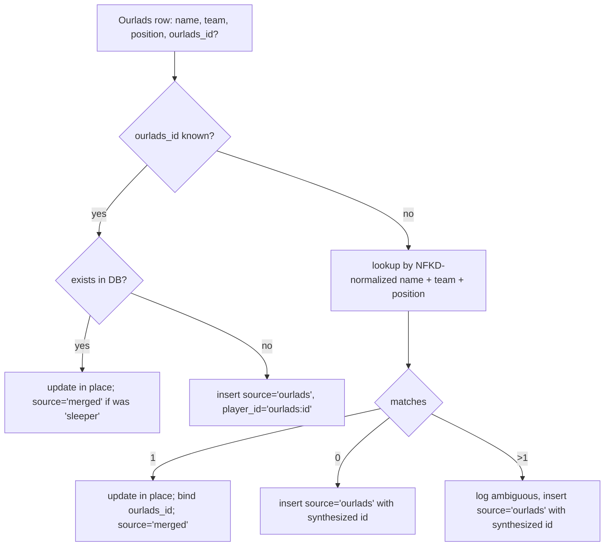
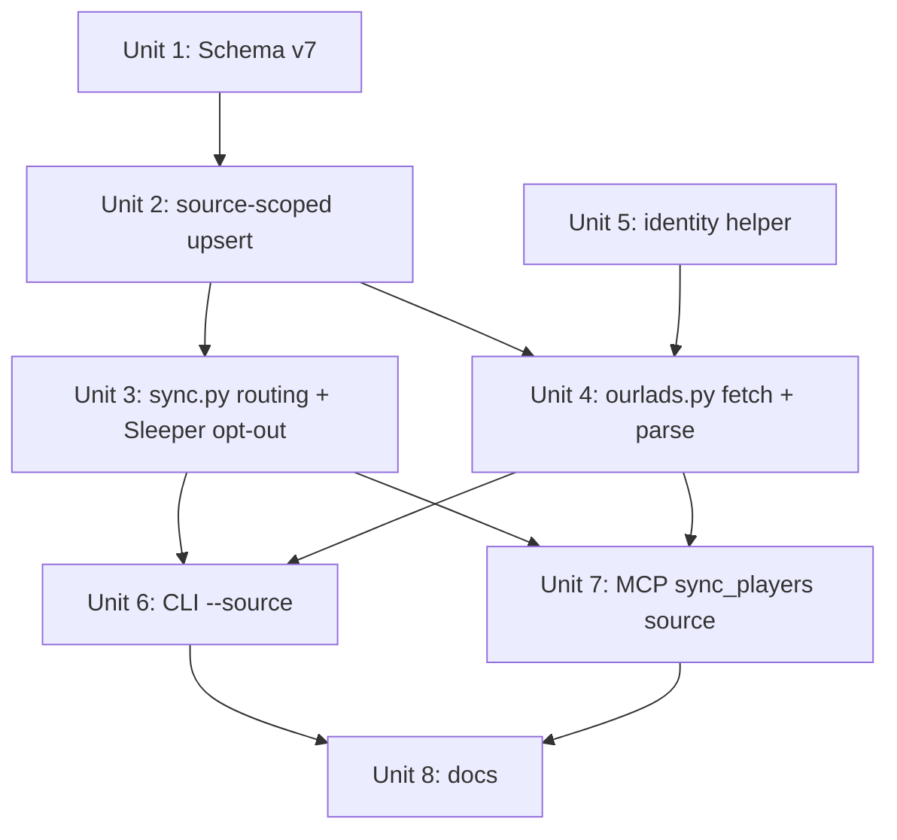

# feat: Ourlads.com depth-chart & roster sync as a second source

## Overview

Add Ourlads.com as a second player-data sync source alongside Sleeper. Ourlads provides hand-curated, beat-reporter-driven depth charts that Sleeper's API often lags. After this work, `ffpresnap-sync --source=ourlads` (and the matching MCP tool) scrapes 33 Ourlads pages — 32 team rosters plus one all-teams depth chart — and merges the results into the existing `players` table without disturbing Sleeper-sourced rows. Ourlads owns depth-chart fields on rows it has touched; Sleeper continues to own bio, identity, and injury data. Ourlads-only players (practice-squad / recently-signed players Sleeper hasn't picked up) become first-class citizens in the table.

## Problem Frame

Sleeper's `depth_chart_position` and `depth_chart_order` lag real beat reporting and frequently disagree with Ourlads on Sunday morning. Because the entire pre-snap value of ffpresnap depends on knowing who's actually starting, every artifact that leans on depth-chart fields (depth-chart explorer, team explorer, watchlist, player-explorer) inherits Sleeper's staleness. The user wants to layer Ourlads on top of Sleeper as a **second source**, capable of overriding stale depth charts and introducing players Sleeper hasn't picked up yet. (See origin: `docs/brainstorms/2026-04-28-ourlads-sync-requirements.md`.)

## Requirements Trace

- **R1–R3 (Source model):** `players` becomes multi-source. Sleeper's wholesale-replace must become source-scoped. Advanced by **Unit 1** (schema v7), **Unit 2** (`upsert_players_for_source`), **Unit 3** (Sleeper path opts out of Ourlads-owned fields).
- **R4 (CLI/MCP shape):** `ffpresnap-sync --source={sleeper,ourlads}` and `sync_players(source=...)`. Advanced by **Unit 6** (CLI), **Unit 7** (MCP).
- **R5 (33-fetch ingestion):** 32 roster pages + 1 all-teams chart. Advanced by **Unit 4** (`ourlads.py` fetch + parse).
- **R6 (`sync_runs` distinguishable by source):** Add `source` column to `sync_runs`. Advanced by **Unit 1**.
- **R7 (on-demand only):** No built-in scheduler; README guidance covers cron. Advanced by **Unit 8** (docs).
- **R8–R11 (Identity matching):** Prefer Ourlads' per-player id; fall back to normalized name+team+position; ambiguous matches insert as Ourlads-only and log. Advanced by **Unit 5** (identity helper) + **Unit 2**.
- **R12 (Conflict resolution):** *Overridden during planning* — flipped from "last-write-wins" to per-field ownership; see Key Technical Decisions. Advanced by **Unit 2** + **Unit 3**.
- **R13 (Absence behavior):** Refined during planning — leave-alone for partial-failure cases; clear when a team's chart was successfully synced and the player isn't on it. Advanced by **Unit 2** (uses `depth_chart_last_observed_at`).
- **R14 (Each source writes only observed fields):** Sleeper writes Sleeper fields; Ourlads writes only the fields it extracts. Advanced by **Unit 2** + **Unit 3**.
- **R15 (Reads unchanged):** `get_depth_chart`, `get_player`, `list_players`, `find_player` callsites untouched. Advanced by **Unit 2** (single shared `players` table, no read-path churn).

### Origin Open Design Questions — disposition

- **R12 footgun** → resolved during planning (per-field ownership; see Decisions).
- **R13 zombies** → resolved during planning (`depth_chart_last_observed_at` + clear-on-successful-team-sync).
- **Identity collisions** → resolved during planning (NFKD normalization, suffix stripping, ambiguous-on-multimatch policy).
- **Mid-week trades** → resolved during planning (persist `ourlads_id` ↔ `player_id` binding on first match).
- **Parse-failure / partial-page** → resolved during planning (per-page row-count band; per-team transaction; run-level abort threshold).
- **Notes-survival mechanism** → resolved during planning (canonical `player_id` is immutable post-insert; identity merge updates row in place).
- **Paste-driven alternative** → considered and rejected; see Alternative Approaches Considered.

## Scope Boundaries

- **Not** introducing real-time / push-based sync. Manual or cron-triggered only.
- **Not** building an alias / manual-correction UI for identity-match failures. Failures are logged; a follow-up `merge_players` MCP tool is explicitly out of scope.
- **Not** reconciling bio fields (height, weight, age, college) from Ourlads. Sleeper remains the canonical bio source for matched rows.
- **Not** adding a third source or a generalized source plugin system. Just Sleeper + Ourlads, as concrete pipelines that share a single `upsert_players_for_source` writer.
- **Not** changing prompt-library prompts or artifact code. They keep reading the same fields.
- **Not** migrating existing notes/mentions — they remain attached to current `player_id`s, which are preserved.

## Context & Research

### Relevant Code and Patterns

- **`src/ffpresnap/db.py` — `Database` class.** Single `sqlite3.Connection`, integer `SCHEMA_VERSION` (currently 6), `_migrate()` arms migrations forward, then re-runs `SCHEMA_V2` (the canonical full schema — name is historical) idempotently. Mirror the additive-column pattern from v5→v6 (`ALTER TABLE ... ADD COLUMN` with a `PRAGMA table_info` guard).
- **`src/ffpresnap/db.py:447 replace_players`** — the wholesale-replace logic this plan splits into source-scoped `upsert_players_for_source(source, rows)`. Note that `note_player_mentions.player_id` has `ON DELETE CASCADE` (line 128); identity-merge logic must reassign mentions before the delete or risk silent loss.
- **`src/ffpresnap/sleeper.py`** — Fetcher seam (`Fetcher = Callable[[str], bytes]`) + `_default_fetch` using stdlib `urllib.request` with manual gzip handling. Mirror exactly in `ourlads.py`.
- **`src/ffpresnap/sync.py:run_sync`** — `record_sync_start` → fetch → project → DB write → `record_sync_finish`. The error path catches and re-records. Extend signature to `run_sync(db, *, source, fetch=None)`.
- **`src/ffpresnap/cli.py`** — currently has zero argument parsing. This plan introduces stdlib `argparse` (consistent with the no-new-dep policy elsewhere).
- **`src/ffpresnap/server.py:24-31, 350`** — the `sync_players` MCP tool definition + dispatch. Add `source` to `inputSchema`.
- **Test conventions:** `tests/test_sync.py` injects `fetch=lambda url: payload`; tests never touch the network. `tests/test_db.py` hand-builds a prior-version DB and asserts post-migration shape. Mirror both.

### Institutional Learnings

- `docs/solutions/` does not exist in this repo. Consider running `/ce:compound` after this work ships to capture non-obvious gotchas (rate-limiting choices, name-normalization edge cases, schema-migration sequencing) for future multi-source work.

### External References

- **Ourlads.com depth-chart & roster pages.** Roster URL: `https://www.ourlads.com/nfldepthcharts/roster/<TEAM>` (32 teams). All-teams depth chart URL: TBD — to be verified during Unit 4 by manual inspection. Both pages are HTML.
- **`beautifulsoup4`** — pure-Python HTML parser, the canonical Python choice. Selector-based extraction; pinned in `pyproject.toml`.
- No Ourlads public API exists. Scraping is the documented ingestion mechanism.

## Key Technical Decisions

- **Source-tracking representation: a `source TEXT NOT NULL` column on `players`.** Values: `'sleeper'`, `'ourlads'`, `'merged'` (matched in both). Cleanest read path (`SELECT ... WHERE source = ?` for source-scoped DELETE) and lowest cognitive load. Existing rows backfill to `'sleeper'` during the v7 migration. The migration unconditionally runs `UPDATE players SET source='sleeper' WHERE source IS NULL` after the `ALTER TABLE` (idempotent; defends against a partial prior migration that left NULL `source` values).
- **`player_id` is immutable post-insert.** This is the central guarantee that makes notes/mentions FKs survive identity merges. Sleeper-sourced rows keep Sleeper's id forever. Ourlads-only rows are inserted with `player_id = 'ourlads:<their_id>'`. When an Ourlads roster row matches an existing Sleeper row, we **update the existing row in place** (set `ourlads_id`, bump `source` to `'merged'`) — we do not delete and reinsert with a new id.
- **Per-field ownership over last-write-wins.** Sleeper sync skips writing `depth_chart_position` and `depth_chart_order` for any row where `source IN ('ourlads', 'merged')`. This eliminates the cron-ordering footgun the document review identified (running Sleeper after Ourlads no longer reverts the depth chart). Implementation cost: one extra `WHERE` clause in the Sleeper UPSERT path.
- **Identity matching is two-phase, with `ourlads_id` as a binding.** First lookup: `WHERE ourlads_id = ?` (uses the previously-bound mapping; survives mid-week trades). Fallback: normalized full name + team + position. On exactly one match, update in place and bind `ourlads_id`. On zero matches, insert as `source='ourlads'`. On more than one match, treat as ambiguous (R11): insert as Ourlads-only, log both candidate `player_id`s to stderr.
- **Name normalization is explicit:** NFKD-decompose, drop combining marks, strip suffixes (`Jr`, `Sr`, `II`, `III`, `IV`), collapse whitespace, lowercase. This is a small helper in `src/ffpresnap/_naming.py`; testable in isolation.
- **`depth_chart_last_observed_at` per player tracks zombie risk.** Set whenever a player appears on a successfully-parsed depth chart. R13 absence rule refined: when an Ourlads run successfully parses team T's depth-chart slice and a player rostered on team T is not in that slice, **clear** their depth-chart fields. When the team-slice failed sanity checks (parse failure, low row count), **leave fields alone**. The record-completeness flag lives on a transient per-team result struct, not in the schema.
- **Per-team transaction with sanity bands.** Each team's roster + chart slice writes within its own savepoint. If the roster page returns fewer than `MIN_ROSTER_ROWS = 30` rows or more than `MAX_ROSTER_ROWS = 120`, the team's slice is rolled back and marked failed. If more than `MAX_FAILED_TEAMS = 5` teams fail, the entire run is aborted and `sync_runs.status = 'error'`. Below 5, the run is `'success'` but `players_written` reflects only successful teams; failed teams are listed in `sync_runs.error` as a comma-separated abbreviation list with reason codes.
- **Politeness:** 1.5-second delay between requests; one retry with 3-second backoff on connection error or 5xx; abort on 4xx (other than 429, which retries once after `Retry-After` if present). User-Agent: `ffpresnap/<version>` — if/when this repo is published, append the canonical URL; until then ship without a URL portion to avoid attributing traffic to an unrelated repo. Stdlib `urllib.request` continues to be the HTTP client (no `httpx`/`requests`). TLS verification uses Python defaults; the implementer must not pass an unverified `SSLContext`.
- **`beautifulsoup4` is a runtime dependency, used with the stdlib `html.parser` backend explicitly.** Pinned in `pyproject.toml`. Constructed as `BeautifulSoup(html, "html.parser")` everywhere — never let BS4 auto-select `lxml` (deterministic backend selection across user environments, no XML code paths reachable). The first runtime dep beyond `mcp`. Stdlib `html.parser` alone was rejected: ~200 LOC of brittle state machine vs ~50 LOC of selector code, with high re-cost on any Ourlads layout tweak.
- **Bounded log/error formats.** Identity-match ambiguity logs structured tuples to stderr: `ourlads:identity:ambiguous: name=<normalized> team=<abbr> position=<pos> candidates=[<player_id_a>,<player_id_b>] synthesized=<new_id>`. Parse-failure logs structured tuples: `ourlads:parse:fail: url=<url> rows=<count> error=<error_class>`. Never log raw response bytes; truncate name/team strings to known-bounded lengths. ToolError messages from the MCP dispatcher carry the same structured form so logs the user shares (issue reports, etc.) cannot leak Ourlads HTML or other scraped content.
- **ToS / robots.txt stop condition (literal):** Before merging Unit 4, `python -c "import urllib.robotparser; rp=urllib.robotparser.RobotFileParser(); rp.set_url('https://www.ourlads.com/robots.txt'); rp.read(); print(rp.can_fetch('ffpresnap', 'https://www.ourlads.com/nfldepthcharts/roster/ATL'))"` must print `True`. If it prints `False`, or if the ToS prohibits automated access regardless of robots.txt, do not merge Unit 4 — fall back to the paste-driven `set_depth_chart(team, paste_text)` design preserved in Alternative Approaches. The fetcher also calls `urllib.robotparser` at runtime so a future ToS tightening fails closed rather than silently scraping.
- **`sync_runs.source` column with default `'sleeper'`.** Makes per-source `last_sync(source=None)` queries trivial. Each Ourlads run is **one** `sync_runs` row (not 33). `source_url` records the roster base URL; per-team failures live in the `error` column.
- **MCP tool dispatch stays synchronous.** A 33-fetch run can take ~60 seconds and will block the MCP event loop. This matches today's Sleeper sync model and is acceptable for a single-user local tool. The tool description is updated to flag the duration.

## Open Questions

### Resolved During Planning

- **How is "source" tracked?** → `source TEXT NOT NULL` column on `players` with values `{'sleeper','ourlads','merged'}`. Backfilled to `'sleeper'` for existing rows in the v7 migration.
- **What guarantees note FK survival across matches?** → `player_id` is immutable post-insert. Identity merges update rows in place, never delete-and-reinsert with a new id.
- **R12 conflict resolution** → per-field ownership (Sleeper opts out of `depth_chart_position`/`_order` for `source IN ('ourlads','merged')`). Cron-order independent.
- **R13 absence behavior** → conditional on whether the team's chart slice was successfully parsed; clear when yes, leave alone when no.
- **Identity collisions** → NFKD-normalize, strip suffixes; on >1 match, insert as Ourlads-only and log.
- **Mid-week trades** → persist `ourlads_id` ↔ `player_id` binding on first match; subsequent runs lookup by `ourlads_id` regardless of team.
- **Parser library** → `beautifulsoup4`, pinned in `pyproject.toml`.
- **CLI flag shape** → stdlib `argparse`, `--source={sleeper,ourlads}`, default `sleeper`.
- **Scheduling** → on-demand only; README documents the recommended cron ordering (Sleeper first, then Ourlads).
- **Logging surface for identity-match failures** → stderr, prefixed with `ourlads:identity:`. No new table.
- **`sync_runs.source` representation** → new column, default `'sleeper'` (v7 migration).
- **Politeness defaults** → 1.5s delay, 30s timeout, retry-once-on-5xx-with-3s-backoff, attributed User-Agent.
- **Sanity band thresholds** → `MIN_ROSTER_ROWS=30`, `MAX_ROSTER_ROWS=120`, `MAX_FAILED_TEAMS=5`. Module-level constants; tunable later if needed.

### Deferred to Implementation

- **All-teams depth-chart page URL.** The user described it but didn't paste the URL; verify by manual inspection during Unit 4. If no such page exists, fall back to 32 per-team chart fetches (64 fetches total, doubling the politeness budget — increase delay to 2.0s).
- **Whether Ourlads exposes a stable per-player profile id in HTML.** Inspect a real page during Unit 5. If yes (e.g., `<a href="/players/12345">`), use it as `ourlads_id`. If no, fall back to a synthesized id of the form `<TEAM>:<jersey>:<normalized_name>`. The schema column `ourlads_id TEXT` accepts either.
- **Exact CSS selectors / row structure for both pages.** Determined empirically while writing Unit 4's parser. The `Fetcher` seam means the parser can be exercised against fixture HTML in tests once a real page has been saved.
- **Final verbiage of `ToolError` messages and stderr identity-match log lines.** Wordsmith during implementation.
- **Whether Ourlads' robots.txt and ToS permit our cadence.** Verify by reading both before merging Unit 4. If a stricter policy applies (e.g., disallow), revisit Unit 4's politeness defaults or pause the unit.
- **Specific Ourlads injury / status fields exposed on the roster page.** R14 says Ourlads writes only what it observes; if useful injury hints are present, the parser may opportunistically set them. Plan-time we assume only depth-chart fields and roster identity.

## High-Level Technical Design

> *This illustrates the intended approach and is directional guidance for review, not implementation specification. The implementing agent should treat it as context, not code to reproduce.*

### Data flow

```
ffpresnap-sync --source=sleeper          ffpresnap-sync --source=ourlads
        |                                          |
        v                                          v
  Sleeper API JSON (one fetch)         32 roster pages + 1 all-teams chart
        |                                          |
   project rows                          parse rosters (per team)
        |                                          |
        v                                          v
   db.upsert_players_for_source('sleeper', rows)  per-team:
        |                                            try savepoint:
        | WHERE source = 'sleeper':                    upsert by ourlads_id->name+team+position
        |   * insert/update Sleeper rows             release savepoint OR rollback on sanity-fail
        |   * delete Sleeper rows not in input       collect last_observed_at for matched players
        | WHERE source IN ('ourlads','merged'):     parse all-teams chart -> apply depth fields
        |   * skip depth_chart_position/_order      clear depth fields for present-on-team-but-not-on-chart
        v                                            |
                                                     v
                                           db.upsert_players_for_source('ourlads', rows, completeness)
                                                     |
                                                     v
                              players (single shared, source-tagged)
                                                     |
                                                     v
                              get_depth_chart / get_player / list_players (unchanged contract)
```

### Identity-match decision flow (Ourlads roster row)



### Schema delta (v6 → v7)

| Table | Change |
|---|---|
| `players` | `+ source TEXT NOT NULL DEFAULT 'sleeper'` |
| `players` | `+ ourlads_id TEXT` (nullable) |
| `players` | `+ depth_chart_last_observed_at TEXT` (nullable, ISO8601) |
| `sync_runs` | `+ source TEXT NOT NULL DEFAULT 'sleeper'` |

No new indexes are added. The DB has only ~2-3k player rows; sequential scans for source-scoped DELETE and `ourlads_id` lookup are microseconds. Add indexes only if a measured perf problem appears.

The `meta.schema_version` row bumps from `6` to `7`. The `_migrate` arm uses `ALTER TABLE ... ADD COLUMN` with a `PRAGMA table_info` guard, mirroring v5→v6.

## Implementation Units



- [ ] **Unit 1: Schema v7 — source tracking, ourlads_id, last_observed_at**

**Goal:** Bump schema version, add columns and indexes that source-scoped upsert depends on. Backfill existing rows.

**Requirements:** R1–R3, R6.

**Dependencies:** None.

**Files:**
- Modify: `src/ffpresnap/db.py` (bump `SCHEMA_VERSION` to 7; add columns to `SCHEMA_V2`; add `if current < 7:` migration arm; extend `PLAYER_FIELDS` if appropriate; ensure `_player_row` returns the new columns).
- Test: `tests/test_db.py` (new `test_v6_db_migrates_to_v7_*` cases).

**Approach:**
- Three new columns on `players`: `source`, `ourlads_id`, `depth_chart_last_observed_at`. `source` is `NOT NULL DEFAULT 'sleeper'` (so existing rows backfill on `ALTER TABLE`). The other two are nullable.
- One new column on `sync_runs`: `source NOT NULL DEFAULT 'sleeper'` (existing rows backfill).
- No new indexes (see Schema delta note above).
- The entire v6→v7 arm runs inside a single `BEGIN; ... COMMIT` transaction. Each `ALTER TABLE` is preceded by a `PRAGMA table_info` guard so partial-prior-application is idempotent. After the ADD COLUMNs, run `UPDATE players SET source='sleeper' WHERE source IS NULL` and `UPDATE sync_runs SET source='sleeper' WHERE source IS NULL` to defend against any prior hand-modification that left NULL values. Only bump `meta.schema_version` to `7` after every step succeeds.
- Decide whether `source` joins `PLAYER_FIELDS` (yes — it's sync-overwritable in the upsert path) or stays separate like `watchlist` (no — that's user-owned). Add `source` to `PLAYER_FIELDS` and let `_player_row` expose it.
- `ourlads_id` and `depth_chart_last_observed_at` should also enter `PLAYER_FIELDS` so they show up in read responses.

**Patterns to follow:**
- `db.py:302-309` (v5→v6 ADD COLUMN pattern) — the canonical additive-migration template in this repo.

**Test scenarios:**
- *Happy path:* fresh DB after `Database.open()` has `SCHEMA_VERSION == 7`; new columns exist with expected types and defaults.
- *Migration:* hand-build a v6 DB with one player row, set `meta.schema_version=6`; reopen; assert the row's `source == 'sleeper'`, `ourlads_id IS NULL`, `depth_chart_last_observed_at IS NULL`.
- *Migration idempotency:* opening an already-v7 DB does not re-add columns or error.
- *`sync_runs.source` backfill:* a v6 row with no source column gets `'sleeper'` after migration.
- *Partial-prior-state defense:* hand-build a v6 DB that already has a `players.source` column populated with NULLs (simulating a prior aborted migration); reopen; assert all rows post-migration have `source='sleeper'`.
- *Transactional rollback:* simulate a mid-arm failure (e.g., monkeypatch the second `ALTER` to raise); assert `meta.schema_version` is still `6` afterward and no half-applied schema is observable.

**Verification:**
- `pytest tests/test_db.py` passes including the new migration test.
- `Database.open()` against a fresh DB exposes the new columns; against a v6-seeded DB migrates without data loss.

---

- [ ] **Unit 2: Source-scoped upsert + identity-merge**

**Goal:** Replace `replace_players` with `upsert_players_for_source(source, rows, *, completeness)` that scopes deletes by source, performs identity merges, preserves note FKs, and bumps `depth_chart_last_observed_at`.

**Requirements:** R1, R3, R8–R11, R13, R14, R15.

**Dependencies:** Unit 1 (schema), Unit 5 (identity helper).

**Files:**
- Modify: `src/ffpresnap/db.py` (new public method `upsert_players_for_source`). The old `replace_players` is **removed** in this unit; Unit 3 updates its only caller (`sync.py:run_sync`) to call `upsert_players_for_source('sleeper', rows)` directly. Removing rather than wrapping avoids leaving dead code.
- Test: `tests/test_db.py` (new test cluster `TestUpsertPlayersForSource`; existing `replace_players` tests are migrated to the new method name).

**Approach:**
- Signature: `upsert_players_for_source(source: str, rows: list[dict], *, completeness: dict[str, bool] | None = None, run_start_at: str | None = None) -> int`.
  - `rows` carry `player_id`, `team`, `full_name`, `position`, optional `ourlads_id`, optional depth-chart fields.
  - `completeness` is a `team_abbr → bool` map indicating whether that team's depth chart was fully observed in this run (used for the conditional R13 clear). When `None` (Sleeper sync, or initial Ourlads insert before merge), no clear behavior runs.
  - `run_start_at` is the ISO timestamp captured by `record_sync_start` *before any fetches begin*. The R13 clear compares each candidate row's `depth_chart_last_observed_at` against this value (rows last observed before the run started are absent from the current run's chart).
- Identity matching uses helpers from Unit 5: `_naming.normalize_full_name(name)` and the in-`db.py` query helper `find_player_for_match(db_conn, normalized_name, team, position) -> list[dict]`. The decision flow itself lives inline in this method (it needs the open transaction); Unit 5 provides the leaf primitives.
- Inside one `BEGIN IMMEDIATE`:
  1. For each input row, run the identity-match decision flow from the High-Level Technical Design. Insert or update accordingly. For Ourlads `'merged'` updates of existing Sleeper rows, do not overwrite Sleeper-owned fields (`first_name`, `last_name`, `birth_date`, etc.) — write only what Ourlads observed. For Sleeper updates of existing rows, skip `depth_chart_position` / `_order` if `source IN ('ourlads','merged')`. **The Sleeper opt-out is implemented here in `upsert_players_for_source`; Unit 3's Sleeper branch does not need to add any extra skip logic — it just calls this method.**
  2. Bump `depth_chart_last_observed_at = run_start_at` for any row whose depth-chart fields were just set (using `run_start_at` rather than `now()` ensures the R13 clear in step 4 uses a consistent comparison baseline).
  3. After upserts, **delete-not-in-set scoped by source**: `DELETE FROM players WHERE source = 'sleeper' AND player_id NOT IN (...)` for Sleeper sync. For Ourlads sync, **do not delete** Ourlads-only rows en masse — Ourlads doesn't claim to enumerate every player, only those it lists. Ourlads roster removal is signal-noisy; defer to a future unit if the user reports zombie buildup. After the player DELETE, run the existing orphan-note cleanup: `DELETE FROM notes WHERE subject_type='player' AND subject_id NOT IN (SELECT player_id FROM players)` (mirrors today's `replace_players` cleanup at `db.py:485-501`).
  4. For R13: when `source='ourlads'` and `completeness[team] is True`, clear `depth_chart_position` and `_order` for rows on that team where `source IN ('ourlads','merged')` and `depth_chart_last_observed_at < run_start_at`.
  5. Commit.
- For identity-merge updates that change `source` from `'sleeper'` to `'merged'`: just `UPDATE players SET source='merged', ourlads_id=?, ...`. The `player_id` does not change; note/mention FKs are untouched.
- Watchlist column remains preserved across syncs (existing pattern: not in `PLAYER_FIELDS` UPSERT set).

**Technical design:**
- The conditional clear in step 4 is the only place where R13 differs from the original "leave alone" rule. Make sure `depth_chart_last_observed_at` is set for *every* row whose depth fields were observed in this run before the clear runs.

**Patterns to follow:**
- `db.py:447 replace_players` — transactional shape, `BEGIN`/`commit`/`rollback` pattern, executemany UPSERT.
- `db.py:484-492` — note cleanup on player drop (kept; just scoped to `source='sleeper'`).

**Test scenarios:**
- *Happy path — Sleeper insert:* fresh DB; upsert 3 sleeper rows; assert all 3 present with `source='sleeper'`.
- *Happy path — Ourlads-only insert:* DB has 3 sleeper rows; upsert 1 Ourlads row that doesn't match any (different name); assert 4 rows total, new one has `source='ourlads'` and `player_id='ourlads:<id>'`.
- *Happy path — identity merge:* DB has Sleeper player Bijan Robinson on ATL; upsert Ourlads row with same name+team+position; assert one row, `source='merged'`, `ourlads_id` populated.
- *Notes survive merge:* Sleeper player has 2 notes and 1 mention; identity-merge from Ourlads; notes/mention rows still reference the same `player_id`, count unchanged.
- *Sleeper opt-out on existing Ourlads row:* DB has `source='ourlads'` row with `depth_chart_position='RB'`; upsert a Sleeper row whose `player_id` matches and whose `depth_chart_position='WR'`; assert row's `depth_chart_position` is still `'RB'` (Sleeper opt-out).
- *Source-scoped DELETE:* DB has 2 sleeper rows + 1 Ourlads-only row; Sleeper sync run with only 1 sleeper row in input; assert the missing sleeper row is deleted; the Ourlads-only row survives.
- *R13 clear (full team observed):* row exists with `source='merged'`, `depth_chart_position='RB1'`, team=BUF; Ourlads sync provides complete BUF chart that does not include this player; assert depth fields are cleared post-run.
- *R13 leave-alone (partial team failure):* same as above but `completeness[BUF]=False` (sanity band failed); assert depth fields are NOT cleared.
- *Edge — ambiguous match:* DB has 2 sleeper rows with the same normalized name on the same team and position (manually constructed); Ourlads upsert with that name; assert row count goes from 2 to 3 (insert as Ourlads-only); both candidate `player_id`s logged to stderr.
- *Edge — `ourlads_id` binding survives trade:* DB has `source='merged'` row with `ourlads_id='12345'` on KC; Ourlads sync now lists same `ourlads_id` on SF; assert single row, `team='SF'`, no duplicate.
- *Integration — note mention reattachment:* run `add_note` mentioning a Sleeper player; identity-merge that player from Ourlads; assert `note_player_mentions.player_id` still matches and the note still appears in `get_player(player_id).mentions`.

**Verification:**
- `pytest tests/test_db.py` passes including all new scenarios above.
- A scripted dry run sequence — Sleeper sync → Ourlads sync → Sleeper sync — leaves Ourlads-set depth-chart values intact in the final state.

---

- [ ] **Unit 3: Sync routing + Sleeper opt-out**

**Goal:** `run_sync(db, *, source, fetch=None)` routes between Sleeper and Ourlads pipelines. Sleeper path skips depth-chart writes for non-Sleeper-owned rows.

**Requirements:** R4, R12 (per planning), R14.

**Dependencies:** Unit 2.

**Files:**
- Modify: `src/ffpresnap/sync.py` (`run_sync` gains a `source` keyword; existing logic lifts into `_run_sleeper_sync(...)`; new `_run_ourlads_sync(...)` skeleton calls into Unit 4 + Unit 2).
- Test: `tests/test_sync.py` (existing tests gain `source='sleeper'` explicit; new tests cover routing + Ourlads happy path).

**Approach:**
- Extract the `record_sync_start` → fetch → project → `upsert_players_for_source` → `record_sync_finish` skeleton into a small context-managed helper or keep it inline in each branch — whichever is simpler given two concrete pipelines.
- Sleeper branch: continues to call `_sleeper.fetch_players` and project; writes via `upsert_players_for_source('sleeper', rows, run_start_at=<start_iso>)` (no `completeness` arg). The depth-chart Sleeper opt-out is implemented inside `upsert_players_for_source` (Unit 2); Unit 3's Sleeper branch does not need its own skip logic.
- Ourlads branch: calls into the Ourlads module (Unit 4) which returns `(rows, completeness, errors)`; writes via `upsert_players_for_source('ourlads', rows, completeness=completeness, run_start_at=<start_iso>)`. If `errors` indicates >`MAX_FAILED_TEAMS` failures, raise an exception that is caught and recorded as `sync_runs.status='error'`.
- `record_sync_start` and `record_sync_finish` extended in Unit 1 to take and store `source`.

**Patterns to follow:**
- `sync.py:42-72` (existing `run_sync` shape).
- `sleeper.py` Fetcher seam pattern.

**Test scenarios:**
- *Routing:* `run_sync(db, source='sleeper', fetch=fake_sleeper)` writes only sleeper-source rows; `run_sync(db, source='ourlads', fetch=fake_ourlads)` writes ourlads-source rows.
- *Sleeper opt-out:* run sequence (Sleeper full → Ourlads → Sleeper full); after final Sleeper run, depth-chart values on `source IN ('ourlads','merged')` rows are unchanged from the Ourlads-set values.
- *Ourlads run records sync_runs:* after `source='ourlads'` run, `sync_runs` has a row with `source='ourlads'`, `players_written` matches the actual upsert count.
- *Error path — Ourlads abort:* fake fetcher returns torn pages on 6 teams; `run_sync(db, source='ourlads')` raises and `sync_runs.status='error'`, `error` contains the team list.
- *Error path — Sleeper unchanged:* invalid source raises before any DB mutation.

**Verification:**
- `pytest tests/test_sync.py` passes; routing test confirms isolation.
- `db.last_sync(source='sleeper')` and `db.last_sync(source='ourlads')` return the right rows after a mixed sequence.

---

- [ ] **Unit 4: Ourlads fetch + parse pipeline**

**Goal:** A new module `src/ffpresnap/ourlads.py` performs 33 fetches (32 roster + 1 all-teams chart), parses HTML via BS4, and returns structured rows + per-team completeness.

**Requirements:** R5, R7, R14.

**Dependencies:** Unit 5 (identity helper used by parsers).

**Execution note:** Inspect a real Ourlads page (one team roster + the all-teams chart) before writing the parser. Save the fetched HTML as a fixture in `tests/fixtures/ourlads/` so the parser can be exercised offline.

**Files:**
- Create: `src/ffpresnap/ourlads.py` (Fetcher seam, fetch orchestration, BS4 parsers, sanity bands).
- Modify: `pyproject.toml` (add `beautifulsoup4>=4.12` to `dependencies`).
- Create: `tests/fixtures/ourlads/roster_<TEAM>.html`, `tests/fixtures/ourlads/all_chart.html` (saved HTML fixtures from real pages).
- Test: `tests/test_ourlads.py` (parsers + sanity bands + politeness).

**Approach:**
- Module shape mirrors `sleeper.py`:
  - `OURLADS_ROSTER_URL_TEMPLATE = "https://www.ourlads.com/nfldepthcharts/roster/{team}"`
  - `OURLADS_ALL_CHART_URL = ...` (TBD — verified during this unit; if no such page exists, fall back to per-team chart URLs and double the fetch count + delay).
  - `Fetcher = Callable[[str], bytes]` and `_default_fetch(url) -> bytes` (with retry + politeness + User-Agent).
  - `fetch_team_roster(team: str, *, fetcher=None) -> list[RosterRow]` and `fetch_all_charts(*, fetcher=None) -> dict[team, list[ChartRow]]`.
  - `fetch_all(*, fetcher=None) -> tuple[list[dict], dict[str, bool], list[TeamError]]` orchestrates all 33 fetches with the politeness delay; returns `(rows, completeness, errors)` consumed by Unit 3.
- `RosterRow` carries: `name`, `team`, `position`, `jersey`, `ourlads_id` (optional). `ChartRow` carries: `team`, `name`, `position`, `depth_chart_position`, `depth_chart_order`.
- Sanity bands per page:
  - Roster: `MIN_ROSTER_ROWS=30`, `MAX_ROSTER_ROWS=120`. Outside band → mark team failed.
  - All-teams chart: total rows in `MIN_TOTAL_CHART=600`, `MAX_TOTAL_CHART=1500`. Outside band → mark whole chart failed (no chart writes; rosters still apply).
- Politeness:
  - 1.5s `time.sleep` between requests.
  - One retry on 5xx or `URLError` with 3s backoff. Honor `Retry-After` on 429.
  - 30s socket timeout (mirrors `sleeper.py`).
  - User-Agent: `f"ffpresnap/{__version__} (+https://github.com/<repo>)"`.
- Identity merge into `players` rows happens upstream in Unit 2; this module only emits flat row dicts.

**Patterns to follow:**
- `sleeper.py:22-33` (`_default_fetch` shape, gzip handling, error wrapping). **Note:** `sleeper.py` does not implement retry or status-code branching — the Ourlads `_default_fetch` will be more elaborate. Inside the `HTTPError` handler, inspect `e.code`: 5xx and connection errors retry once; 4xx aborts; 429 honors `e.headers.get('Retry-After')` for one retry. Do not copy `sleeper.py:30-31` verbatim.
- `tests/test_sleeper.py` (Fetcher injection pattern).

**Test scenarios:**
- *Roster parser — happy path:* feed `roster_BUF.html` fixture; assert correct number of rows, correct names+positions+jerseys.
- *Roster parser — ourlads_id extraction:* if profile links present, `ourlads_id` is populated; otherwise `None`.
- *All-teams chart parser — happy path:* fixture parses into `{team: [chart_rows]}` with expected team count (32) and ranking order.
- *Sanity band — short page:* fixture with 12 rows triggers `MIN_ROSTER_ROWS` failure; team is in errors list, no rows returned for it.
- *Sanity band — chart partial:* fixture with rows below `MIN_TOTAL_CHART` (e.g., 400) triggers chart-level failure; rosters still apply, completeness=False everywhere.
- *Politeness — delay observed:* test with a fake clock or a mock that asserts `time.sleep(>=1.5)` was called between requests.
- *Politeness — retry on 5xx:* fake fetcher raises 503 once then succeeds; assert one retry and final success.
- *Politeness — abort on 4xx:* fake fetcher returns 403 for a team; team marked failed, no retry.
- *Error wrapping — network error:* fake fetcher raises `URLError`; appears as `OurladsFetchError` in the team's error entry.
- *URL construction:* `team='ATL'` produces the expected URL.

**Verification:**
- `pytest tests/test_ourlads.py` passes with fixtures in place.
- A real-network smoke test (run manually, not in CI): `python -c "from ffpresnap.ourlads import fetch_all; print(fetch_all())"` returns a populated structure for at least 30 teams.

---

- [ ] **Unit 5: Name normalization + identity helper**

**Goal:** A small reusable helper `src/ffpresnap/_naming.py` that normalizes player names for matching and a top-level `match_or_synthesize(db_conn, ourlads_row) -> MatchResult` helper.

**Requirements:** R8–R11.

**Dependencies:** Unit 1 (schema).

**Files:**
- Create: `src/ffpresnap/_naming.py` (`normalize_full_name`, `synthesize_ourlads_id`).
- Modify: `src/ffpresnap/db.py` (add `find_player_for_match(name, team, position) -> list[dict]` query helper) — or place this helper directly in Unit 2's upsert if cleaner.
- Test: `tests/test_naming.py` (normalization rules).

**Approach:**
- `normalize_full_name(name: str) -> str`: NFKD-decompose → drop combining marks → strip suffixes (`Jr`, `Jr.`, `Sr`, `Sr.`, `II`, `III`, `IV`, `V`) → strip apostrophes/periods → collapse whitespace → lowercase.
- `synthesize_ourlads_id(team: str, jersey: str | None, normalized_name: str) -> str`: `f"{team}:{jersey or '?'}:{normalized_name.replace(' ', '_')}"`.
- `find_player_for_match` runs a SQL query: `SELECT player_id FROM players WHERE LOWER(REPLACE(REPLACE(full_name, '.', ''), '''', '')) = ? AND team = ? AND position = ?`. Application-side normalization is preferred over SQL because the SQL form can't easily replicate NFKD; do the normalization in Python and store/index the normalized form if the query becomes a perf issue. (Premature: don't add the index now.)

**Patterns to follow:**
- Keep `_naming.py` dependency-free (stdlib `unicodedata` only).

**Test scenarios:**
- *Diacritics:* `normalize_full_name("José") == "jose"`.
- *Suffixes:* `normalize_full_name("Marvin Mims Jr.") == "marvin mims"`.
- *Apostrophes:* `normalize_full_name("D'Andre Swift") == "dandre swift"`.
- *Whitespace:* `normalize_full_name("  Patrick   Mahomes  ") == "patrick mahomes"`.
- *Roman numerals:* `normalize_full_name("Kenneth Walker III") == "kenneth walker"`.
- *Synthesized id format:* `synthesize_ourlads_id("ATL", "7", "bijan robinson") == "ATL:7:bijan_robinson"`.
- *Synthesized id missing jersey:* jersey=None → `?` in slot.
- *Unicode edge:* normalization is idempotent on already-normalized input.

**Verification:**
- `pytest tests/test_naming.py` passes.
- `_naming.py` has no imports beyond `unicodedata` and `re`.

---

- [ ] **Unit 6: CLI `--source` flag**

**Goal:** `ffpresnap-sync` accepts `--source={sleeper,ourlads}` (default `sleeper`) and routes accordingly.

**Requirements:** R4.

**Dependencies:** Unit 3.

**Files:**
- Modify: `src/ffpresnap/cli.py` (introduce stdlib `argparse`).
- Test: `tests/test_cli.py` (existing tests stay green; add Ourlads-source case with monkeypatched fetcher).

**Approach:**
- Add `argparse.ArgumentParser` with one positional/keyword `--source` choice, default `sleeper`.
- Pass through to `run_sync(db, source=args.source)`.
- Preserve the existing one-line success summary format (`tests/test_cli.py:36` asserts on the prefix).
- Success-line format (both sources): `synced <N> players in <T>s (run_id=<R>, source=<source>)`. Maintains the leading `synced ` prefix that `tests/test_cli.py:36` asserts on; the `source=` suffix differentiates runs in logs. Update the existing test assertion only if it checks more than the leading prefix.

**Patterns to follow:**
- `cli.py` (current shape — keep `main()` flat).
- `tests/test_cli.py` (env var sandbox + module-level monkeypatch).

**Test scenarios:**
- *Default:* `ffpresnap-sync` with no flags syncs Sleeper (existing test stays green).
- *Explicit Sleeper:* `--source=sleeper` matches default behavior.
- *Ourlads:* `--source=ourlads` invokes Ourlads pipeline (mocked); summary line printed; exit code 0.
- *Invalid source:* `--source=bogus` exits non-zero with a clear argparse error.
- *Help text:* `--help` lists `--source` with the two valid values.

**Verification:**
- `pytest tests/test_cli.py` passes.
- Manual smoke: `ffpresnap-sync --source=ourlads` from the venv reaches the parser/writer pipeline (real network call optional during CI; a `--dry-run` scaffolding flag is out of scope).

---

- [ ] **Unit 7: MCP `sync_players(source=...)`**

**Goal:** Extend the existing `sync_players` MCP tool to accept an optional `source` arg.

**Requirements:** R4.

**Dependencies:** Unit 3.

**Files:**
- Modify: `src/ffpresnap/server.py` (`TOOLS` entry for `sync_players` — add `source` to `inputSchema` with `enum: ["sleeper","ourlads"]`, default `sleeper`; description notes Ourlads runs may take ~60s).
- Modify: `handle_tool_call` branch for `sync_players` (extract `source`, pass through).
- Test: `tests/test_server.py` (new `test_sync_players_with_ourlads_source`).

**Approach:**
- The dispatcher catches `OurladsFetchError` (new) and converts to `ToolError`, mirroring the existing `SleeperFetchError` handling.
- Tool description should call out: "Long-running: Ourlads sync may take ~60 seconds because it fetches 33 pages with politeness delays."

**Patterns to follow:**
- `server.py:24-31` (`sync_players` definition) and `server.py:350-352` (dispatch).
- Existing exception → `ToolError` conversion.

**Test scenarios:**
- *Default:* `handle_tool_call(db, 'sync_players', {})` runs Sleeper (mocked).
- *Source=sleeper:* explicit `{'source': 'sleeper'}` runs Sleeper (mocked).
- *Source=ourlads:* `{'source': 'ourlads'}` invokes Ourlads pipeline (mocked); response contains `players_written` and `source='ourlads'`.
- *Invalid source:* `{'source': 'bogus'}` raises `ToolError` with a clear message.
- *Fetch error propagation:* Ourlads fake fetcher raises; dispatcher returns `ToolError`, not an unhandled exception.

**Verification:**
- `pytest tests/test_server.py` passes including new scenario.
- Tool description visible in `list_tools` reflects the new arg and the duration note.

---

- [ ] **Unit 8: Documentation updates**

**Goal:** Update README, schema doc, tools doc, and troubleshooting doc to cover the second source. Add a `docs/solutions/` entry capturing the multi-source learnings.

**Requirements:** R7 (cron guidance lives here).

**Dependencies:** Units 1–7.

**Files:**
- Modify: `README.md` (mention Ourlads as a second source; update first-steps to include `--source=ourlads`; cron snippet covers ordering).
- Modify: `docs/schema.md` (document new `players.source`, `ourlads_id`, `depth_chart_last_observed_at`, and `sync_runs.source`).
- Modify: `docs/tools.md` (update `sync_players` entry; add Ourlads example).
- Modify: `docs/troubleshooting.md` (Ourlads-specific troubleshooting: parse failure, ToS pause, partial-team behavior).

After this work ships, run `/ce:compound` to capture the multi-source gotchas as a `docs/solutions/` entry. That artifact is *not* a deliverable of this plan — institutional learnings are written from real incidents, not predicted ones.

**Approach:**
- Cron guidance: recommend Sleeper-then-Ourlads ordering. Even though per-field ownership makes this non-load-bearing, ordering matters for `last_sync` semantics and intuition.
- `docs/schema.md`: include the migration history note (v6 → v7).
- Avoid over-documenting; this codebase favors compact prose.

**Test scenarios:**
- *Test expectation: none — pure documentation.* No test scenarios apply.

**Verification:**
- `grep -r ourlads docs/ README.md` returns hits in every expected file.
- A fresh user reading the README understands they have two sources and how to invoke each.

## System-Wide Impact

- **Interaction graph:** New module `ourlads.py`. New schema columns on `players` and `sync_runs`. The `Database.upsert_players_for_source` method replaces `replace_players` semantics. Existing read methods (`get_depth_chart`, `get_player`, `list_players`, `find_player`) read the unified table without churn — `source` is not part of their response contracts unless the implementer chooses to expose it (low priority; keep the contract stable).
- **Error propagation:** `OurladsFetchError` mirrors `SleeperFetchError` and converts to `ToolError` in the MCP dispatcher. Per-team failures during a run do **not** raise; they're collected and surfaced via `sync_runs.error`. Run-level failures (>`MAX_FAILED_TEAMS`) raise and are caught by `run_sync`'s existing `try/except`.
- **State lifecycle risks:** Identity merges that update `source` from `'sleeper'` to `'merged'` must happen inside the same transaction as the `ourlads_id` write to avoid a window where a row has `source='merged'` but `ourlads_id IS NULL`. Mentions / notes are FK-protected by the immutable `player_id` invariant — any future refactor must preserve it.
- **API surface parity:** The MCP tool surface gains exactly one optional argument on `sync_players`. CLI gains one optional flag on `ffpresnap-sync`. No artifact prompts or UI changes.
- **Integration coverage:** Cross-layer scenarios that unit tests alone don't prove: (a) Sleeper sync → Ourlads sync → Sleeper sync leaves Ourlads-set depth values intact (covered in Unit 3 integration test); (b) note attached to Sleeper player → identity merge → note still reachable via `get_player(player_id)` and `list_notes(scope='player', target_id=...)` (covered in Unit 2 integration test); (c) trade scenario — `ourlads_id` binding survives a team change (covered in Unit 2).
- **Unchanged invariants:**
  - Reads (`get_depth_chart`, `get_player`, `list_players`, `find_player`) keep their current response shapes. Adding `source` / `ourlads_id` to response payloads is a possible future enhancement, explicitly not in this plan.
  - `watchlist` continues to be user-owned and preserved across syncs of either source.
  - `notes`, `studies`, `note_player_mentions`, `note_team_mentions` schemas are untouched. Notes-by-`player_id` semantics are preserved by the immutable-PK invariant.
  - `teams` table is untouched. `seed_teams` continues to be the canonical team source.
  - Existing `replace_players` callers are migrated; no callers retain wholesale-replace semantics.

## Risks & Dependencies

| Risk | Mitigation |
|------|------------|
| Ourlads ToS / robots.txt prohibits scraping at our cadence. | Read both before merging Unit 4. If disallow, pause the unit and reframe as a paste-driven MCP tool (carried forward as a fallback design). |
| All-teams depth-chart page doesn't exist. | Fallback documented: 32 per-team chart fetches (64 total) + 2.0s delay. Verify URL existence in Unit 4 before implementing parsers. |
| Ourlads HTML layout changes silently. | Per-page sanity bands abort affected teams. Saved HTML fixtures in `tests/fixtures/ourlads/` keep parser tests stable; an actual layout change becomes a fixture update + parser tweak rather than a silent data loss. |
| `beautifulsoup4` dep adds install friction. | Pure-Python, has been a Python ecosystem staple since 2009. Pinned to `>=4.12`. Documented in `pyproject.toml`. Acceptable cost for the parser-maintenance reduction. |
| MCP tool blocks the event loop for ~60s during Ourlads sync. | Tool description flags the duration. Single-user local tool — concurrent MCP calls aren't a concern. Future: `asyncio.to_thread` if it becomes painful. |
| Identity-match collisions silently smear data into the wrong row. | Multi-match → ambiguous → insert as Ourlads-only + log. Stricter than auto-merge; minimizes wrong-attribution risk. The unmatched logs surface to the user via stderr; if collisions become a real problem, a `merge_players` tool can be added later. |
| `depth_chart_last_observed_at` clock drift between Sleeper and Ourlads runs. | Use `datetime.now(timezone.utc).isoformat(timespec='seconds')` (existing `_now()` helper). All comparisons are within the SQLite database; no cross-clock concerns. |
| Migration v6 → v7 silently corrupts existing user data. | Migration is purely additive (`ALTER TABLE ADD COLUMN` with defaults). Tested explicitly in Unit 1 against a hand-built v6 DB. No destructive arms. |

## Documentation / Operational Notes

- Update README's first-steps section with a note that `--source=ourlads` exists and what it does.
- Cron snippet (in README) recommends two cron entries: `0 9 * * * ffpresnap-sync --source=sleeper && ffpresnap-sync --source=ourlads` (chained with `&&` so a Sleeper failure doesn't trigger an Ourlads run on stale data).
- The `ToolError` produced by the MCP `sync_players(source='ourlads')` failure path includes the per-team error list when run-level abort triggers, so the agent surface explains *why* the run aborted.
- Operational note: a manual smoke run against real Ourlads should happen during Unit 4 review, before Unit 4 is merged. Save the fetched HTML as fixtures simultaneously.

## Alternative Approaches Considered

- **Paste-driven MCP tool** (`set_depth_chart(team, paste_text)`): Considered during document review. Bypasses scraping infrastructure, ToS, and identity matching at scale. Rejected because the user wants depth charts kept fresh across all 32 teams without per-session pasting effort, and because the cron-driven model integrates with existing artifact reads. The paste tool remains a viable fallback if Ourlads' ToS forces a pivot in Unit 4 — its design is preserved here for that contingency.
- **Last-write-wins on depth-chart fields (R12 as originally written):** Considered and overridden during planning. Per-field ownership eliminates the cron-ordering footgun for ~5 lines of code; the simplicity savings of LWW were illusory because the surprise surface was the entire feature's reason for existing.
- **`source` as id-prefix (`ourlads:<id>`) instead of column:** Rejected because it would either break note FKs on identity merge (PK changes when an Ourlads-only row matches a Sleeper row) or require bookkeeping to keep an old prefix bound to a new id. The dedicated column keeps PK immutable.
- **`stdlib html.parser` instead of `beautifulsoup4`:** Rejected. Hand-rolled state machine for 33 page types is ~200 LOC of fragile code. BS4's pure-Python install footprint is acceptable.
- **Two separate CLI commands (`ffpresnap-sync` and `ffpresnap-sync-ourlads`):** Considered (see brainstorm scope-guardian finding). Rejected in favor of `--source` for ops consistency — one entry point, one cron model. Internal pipelines are still concrete and decoupled (different modules, no shared abstract source class).

## Sources & References

- **Origin document:** [docs/brainstorms/2026-04-28-ourlads-sync-requirements.md](../brainstorms/2026-04-28-ourlads-sync-requirements.md)
- Related code: `src/ffpresnap/db.py:447` (`replace_players`), `src/ffpresnap/sync.py:42` (`run_sync`), `src/ffpresnap/sleeper.py:22` (Fetcher seam template).
- Style template: [docs/plans/2026-04-26-001-feat-sleeper-sync-and-team-depth-chart-plan.md](2026-04-26-001-feat-sleeper-sync-and-team-depth-chart-plan.md).
- External: Ourlads.com `/nfldepthcharts/roster/<TEAM>` (verified URL pattern), all-teams chart URL `https://www.ourlads.com/nfldepthcharts/pfdepthcharts.aspx` (provided by user; structure confirmed by Unit 4 spike against saved HTML fixture).
- External: `beautifulsoup4` documentation — https://www.crummy.com/software/BeautifulSoup/bs4/doc/.

## Post-Review Resolutions

The following decisions were made after document review surfaced P0/P1 design tensions. They override or supplement earlier sections.

- **MCP tool dispatch is async-wrapped (was: synchronous).** `sync_players(source='ourlads')` returns a `run_id` immediately and runs the fetch via `asyncio.to_thread`. A new `get_sync_status(run_id)` MCP tool polls progress (`status`, `players_written`, optional `error`). Sleeper sync stays synchronous — its single ~5s fetch comfortably fits in any reasonable client timeout.
- **Concurrent-sync prevention via `sync_runs` advisory lock.** On every run start (Sleeper or Ourlads), `record_sync_start` first checks for `sync_runs WHERE status='running' AND started_at > now() - INTERVAL 5 MINUTES`. If found, raise `ConcurrentSyncError` (mapped to `ToolError` in MCP). The 5-minute stale-lock timeout handles crashed runs without manual cleanup.
- **Bidirectional identity merge.** Unit 3's Sleeper branch performs Sleeper-side identity merge: before inserting a new Sleeper row, look for an existing `source='ourlads'` row with matching normalized name + team + position. On match: copy `note_player_mentions.player_id` and `notes.subject_id='player'` references from `ourlads:<id>` to Sleeper's `player_id`, then DELETE the ourlads-only row. All inside the same `BEGIN IMMEDIATE`. Adds ~15 LOC + a test scenario to Unit 3.
- **Source demotion on R13 clear.** When Unit 2's R13 clear runs and a `source='merged'` player's depth fields are cleared (Ourlads dropped them), also `UPDATE players SET source='sleeper', ourlads_id=NULL WHERE player_id = ?` for that row. Sleeper resumes ownership on next sync. ~3 extra lines in Unit 2 step 4 + a test scenario.
- **Suffix stripping removed from `normalize_full_name`.** Unit 5's normalization keeps `Jr/Sr/II/III/IV` in the normalized form so they disambiguate father/son and namesake cases. The remaining steps (NFKD, drop diacritics, strip apostrophes/periods, lowercase, collapse whitespace) cover the dominant cases. Update Unit 5 spec and adjust the test scenarios that asserted suffix stripping.
- **All-teams chart URL: `https://www.ourlads.com/nfldepthcharts/pfdepthcharts.aspx`.** Structure to be confirmed by Unit 4's reconnaissance spike (open the page, save HTML to `tests/fixtures/ourlads/all_chart.html`, identify selectors). The 33-fetch shape is now grounded — fallback to 64 fetches only triggers if this URL becomes unreachable.
- **Mid-run team change ordering.** Unit 4's `fetch_all` fetches the all-teams chart **last**, after every per-team roster has been fetched. Then it reconciles chart entries against the just-fetched rosters in memory: chart entries whose team disagrees with that team's roster are dropped (with a warning log). This eliminates the within-run trade race condition.
- **No new schema fields beyond the three already in v7.** The advisory lock uses existing `sync_runs.status` + `started_at`; no separate lock table.
