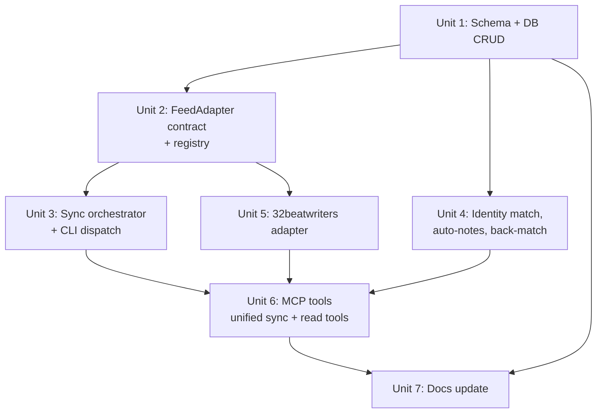

# feat: Generic feed ingestion with 32beatwriters as first source

## Overview

Add a third class of sync to ffpresnap — pluggable **feed adapters** that pull paginated, player-tagged content from external publications and turn each new item into a searchable note on the matched player. Ship 32beatwriters as the first concrete adapter so the abstraction is exercised against a real source from day one. Architecturally this slots in alongside Sleeper and Ourlads via the existing `ffpresnap-sync --source=…` dispatcher; on the MCP side, the existing `sync_players` tool is collapsed into a unified `sync(source=...)` tool that covers all source classes — keeping the model's tool surface flat as feed sources proliferate.

## Problem Frame

ffpresnap already has structured *player* data from two sources (Sleeper, Ourlads). Beat-reporter "nuggets" are a different shape — high-signal commentary tagged to one player — and live behind paywalls or scattered apps. The user found the 32beatwriters API and wants to pull it locally, but more importantly wants the architecture to be source-agnostic so adding *the next* feed (Athletic, Rotoworld, individual reporter feeds) is one new adapter file, not a refactor (see origin: `docs/brainstorms/2026-04-29-feed-ingestion-32beatwriters-requirements.md`).

## Requirements Trace

- **R1.** Two new tables: `feed_sources` + `feed_items` with `(source_id, external_id)` uniqueness — Units 1, 2.
- **R2.** Pluggable `FeedAdapter` interface; new sources are new adapter files — Units 2, 5.
- **R3.** Sync dispatched through existing CLI entry point; MCP surface unified as a single `sync(source=...)` tool covering sleeper, ourlads, and feeds — Units 3, 6.
- **R4.** Feed sync runs use the existing `sync_runs` / `get_sync_status` pattern with feed-specific counters — Unit 1, Unit 4.
- **R5–R6.** Match-or-skip identity; unmatched items stored — Unit 3.
- **R7.** Back-matching mechanism — Unit 4.
- **R8–R10.** New matched items auto-create a `notes` row + mention, idempotent, asymmetric cascade — Units 1 (helper) + 3 (orchestrator path).
- **R11.** Incremental-by-default with `--full` opt-in; max-pages cap — Units 3, 5.
- **R12.** Politeness delay reusing Ourlads' posture — Unit 5.
- **R13.** Optional bearer auth via env var — Unit 5.
- **R14–R15.** Existing notes tools work unchanged on auto-notes; add `list_feed_items` MCP tool — Unit 6.

## Scope Boundaries

- No new `players` rows are created from feeds (match-or-skip; per origin).
- No LLM roll-up summaries in this iteration — per-item notes only.
- No cross-source dedup of similar nuggets.
- No refactor of Sleeper/Ourlads sync paths — feeds are an additive layer.
- No promotion/triage UI for unmatched items; they sit in the table awaiting back-matching.
- Not extracting a shared HTTP utility module from `sleeper.py` / `ourlads.py` in this plan — copy Ourlads' `_fetch_with_retry` into the new adapter; revisit when feed source #3 lands.

## Context & Research

### Relevant Code and Patterns

- **Sync dispatch seam:** `src/ffpresnap/sync.py:44-62` — string-dispatch `if source == ...`. Mirror Ourlads' branch with a single `_run_feed_sync(db, *, adapter_name, fetch=None, full=False)` that looks up adapters from a registry.
- **CLI source enum:** `src/ffpresnap/cli.py:18` — extend `choices` and add a `--full` flag.
- **Schema + migrations:** `src/ffpresnap/db.py:15` (`SCHEMA_VERSION = 7`), `db.py:66-172` (`SCHEMA_V2`), `db.py:264-398` (`_migrate`). New tables = additive bump to `SCHEMA_VERSION = 8`; append `CREATE TABLE IF NOT EXISTS` blocks; add an empty `if current < 8:` block (the trailing `executescript(SCHEMA_V2)` creates the new tables).
- **Adapter precedent:** `src/ffpresnap/ourlads.py` — `Fetcher = Callable[[str], bytes]` test seam (line 120), `_default_fetch` + `_fetch_with_retry` (lines 158-193) with gzip + 5xx/429 backoff, `time.sleep(delay_seconds)` politeness, `OurladsFetchError`, dataclass result types, `fetch_all` orchestrator.
- **Identity match:** `src/ffpresnap/_naming.py:19-39` (`normalize_full_name`) and `src/ffpresnap/db.py:510-526` (`find_player_for_match(name, team, position) -> list[dict]`). Treat `len == 1` as match (mirroring Ourlads' `db.py:805-817`).
- **Team-name → abbr translation:** `src/ffpresnap/teams.py` (`TEAMS` table). 32beatwriters returns full names like `"Cincinnati Bengals"`; `players.team` stores abbrs like `"CIN"`. Build a `{full_name: abbr}` map at adapter load. **Use `ARI` (Sleeper-canonical) for Arizona, not Ourlads' `ARZ`.**
- **Notes write helper:** `src/ffpresnap/db.py:1097-1124` (`Database._add_note(subject_type, subject_id, body, mentions)`). Single transactional helper that writes both `notes` and `note_player_mentions`. Returns hydrated note with `id` — capture for `feed_items.note_id` backref.
- **`sync_runs` lifecycle:** `db.py:1414-1465` — `record_sync_start(source_url, source) -> run_id` (raises `ConcurrentSyncError` on overlap), `record_sync_finish(run_id, players_written, status, error=None)`. Status values are `'running' | 'success' | 'error'` (convention, no CHECK).
- **Background-thread sync pattern:** `src/ffpresnap/server.py:398-478` (`_start_background_ourlads_sync`) — opens a fresh `Database.open()` inside the thread (sqlite3 connections aren't thread-safe), pre-checks the advisory lock in the foreground for clean error UX. Generalize to `_start_background_sync(source)` and reuse for feeds.
- **Test patterns:** `tests/test_ourlads.py:214-226` `_FakeFetcher` returning bytes by URL + fixtures under `tests/fixtures/ourlads/`. `tests/test_sync.py:12-16` per-test `Database.open(tmp_path / "notes.db")` fixture and `fetch=` injection at `run_sync` level.

### Institutional Learnings

- `docs/solutions/` does not exist in this repo — no compounded learnings to inherit. Closest substitutes are `docs/plans/2026-04-28-001-feat-ourlads-sync-plan.md` (the precedent for multi-source sync) and `docs/schema.md` (current schema doc — must be updated as part of Unit 1).

### External References

- 32beatwriters API verified live on 2026-04-29 (unauthenticated `GET /api/nuggets?page=N&limit=L&sortBy=createdAt&sortOrder=desc`, returns `{success, data: {nuggets: [...], pagination: {total, page, limit, totalPages}}}`). Each nugget: `id`, `content` (HTML), `sourceName`, `sourceUrl`, `createdAt`, `playerId`, `player: {id, playerId, name, team, position, headshotPic, rookie}`.

## Key Technical Decisions

- **Single unified `sync(source=...)` MCP tool replaces `sync_players` and the originally-planned `sync_feed`.** The MCP surface mirrors the CLI: one entry point, one `source` parameter, source enum computed as `("sleeper", "ourlads") + tuple(adapter_names())`. Rationale: (a) the FeedAdapter abstraction already commits to source-pluggability — keeping a parallel two-tool MCP surface contradicts that direction; (b) `sync_players` is referenced only in `docs/tools.md` and `README.md` (no prompt-library callers), so renaming is cheap; (c) Claude only has to learn one tool that takes one parameter, and the source-list grows by one string when a new source lands. Response shape: sleeper returns `{status: "success", summary: {...}}` synchronously (~5s); ourlads and feed sources return `{status: "running", run_id: N, source: "..."}` after firing the background thread, and the caller polls `get_sync_status(run_id)`. The shape variance is documented in `docs/tools.md` and is a smaller cognitive cost than maintaining two tool names. The originally-considered `sync_feed` alternative is rejected as adding tool count without adding capability.
- **One generic `_run_feed_sync(db, *, adapter_name, ...)` orchestrator + adapter registry.** Adapters register a name → `FeedAdapter` mapping in a single module; `sync.py` checks the registry before string-matching on legacy sources. Adding source #2 = one new adapter file + one registry line.
- **Generic feed layer at N=1 is deliberate, despite the asymmetry with the HTTP-refactor decision below.** Building `FeedAdapter` Protocol + registry at the first concrete source while *not* extracting shared HTTP could look inconsistent. It isn't: (a) the user's brainstorm explicitly asked for "something generic that if i found another publication or source that is a feed we could store their content in some sort of way on a sync" — pluggability is a stated product requirement, not speculative reuse; (b) the abstraction is small (one Protocol + one dict registry, ~60 lines including the dataclass) and its shape is forced by the requirements rather than invented; (c) extracting shared HTTP would touch `sleeper.py` *and* `ourlads.py`, which is genuine refactor risk against non-feed code. If the FeedAdapter interface needs reshaping when source #2 lands, the cost is renaming one Protocol method.
- **`FeedAdapter` returns a generator of `FeedItem` dataclasses** (`Iterable[FeedItem]`), not a buffered aggregate like Ourlads' `FetchAllResult`. The orchestrator can stop pulling pages the moment it hits a page where every item is already in `feed_items` (R11 incremental). The adapter handles pagination internally; the orchestrator handles dedup + persistence.
- **Auto-note cascade is asymmetric.** `feed_items.note_id REFERENCES notes(id) ON DELETE SET NULL` (deleting an auto-note leaves the raw item). The other direction — deleting a `feed_items` row should cascade-delete its auto-note — is handled application-side in a `delete_feed_item(id)` helper that deletes the linked note and the row in one transaction. SQLite cannot enforce this with FKs because `notes` has no link back to `feed_items`. (A SQLite `TRIGGER AFTER DELETE ON feed_items` would also work and would be self-documenting at the schema layer; rejected here only to avoid introducing the first trigger in the codebase. If a second app-level cascade ever appears, switch to triggers and delete the helper.)
- **Auto-note creation is single-transaction via a new `db.add_feed_item_with_auto_note(...)` helper.** The earlier "extend `upsert_feed_item` OR add a wrapper — pick at implementation time" deferral is resolved: build the wrapper. It opens one transaction that performs the `feed_items` upsert, the `notes` insert, the `note_player_mentions` insert, and the `feed_items.note_id` UPDATE atomically. Returns `(feed_item_id, note_id, was_new)`. This closes the crash-window where a two-step path (`_add_note` then `set_feed_item_note_id`) could orphan a note with no backref.
- **Widen `sync_runs` with feed counters rather than overload `players_written`.** Add four nullable columns: `items_fetched`, `items_new`, `items_matched`, `items_unmatched`. Player-data syncs leave them NULL; feed syncs leave `players_written` NULL. Keeps the breakdown structured for Claude to surface in `get_sync_status` without lossy reinterpretation.
- **Identity match uses existing `(normalized_name, team_abbr, position)` 1-of-N logic.** Adapter is responsible for translating team names to abbrs *before* calling `find_player_for_match`. Ambiguous matches (>1) and zero matches both leave `feed_items.player_id` NULL — same posture as Ourlads, no auto-creation.
- **Bulk-undo for misfiring syncs.** `len == 1` is treated as ground truth, but two real players can share name+team+position (rookie vs veteran during turnover, stale API team field). To make a wrong-match recovery cheap, expose `delete_auto_notes_from_run(run_id) -> int` (and an MCP tool wrapping it in Unit 6). Called against a recent feed `sync_runs.id`, it deletes all auto-notes whose backing `feed_items` were created or first-attached during that run, leaving the raw `feed_items` rows in place with `note_id=NULL`. This gives the user a one-call rollback without resorting to SQL when a sync misfires; idempotency means re-running the sync afterward will not recreate the deleted notes (intentional; consistent with the existing R8–R10 semantics).
- **Auto-note body is plain text + a 3-line plain-text footer.** Format: `<HTML-stripped content>\n\n— <sourceName> · <sourceUrl> · <createdAt ISO date>`. No new `notes` columns; provenance lives in `feed_items` for re-rendering if format changes later.
- **Back-matching runs in two places:** (a) at the end of every successful sync of *any* source as a cheap final pass over recent unmatched items, and (b) as a standalone `rematch_feed_items()` MCP tool for explicit re-runs. The end-of-sync pass is bounded by `WHERE player_id IS NULL AND ingested_at > now() - 30 days` to keep it cheap.
- **HTTP fetcher is duplicated, not extracted.** Copy Ourlads' `_fetch_with_retry` into the new adapter (with a 32beatwriters-specific `User-Agent`). Extracting `ffpresnap/_http.py` waits until feed source #3 makes the duplication a real cost.
- **Concrete defaults:** `--full` off by default; max pages on incremental = 20 (≈300 items at limit=15); page limit = 50 per request; politeness delay = 0.75s between requests; HTTP timeout = 30s; retry posture matches Ourlads (5xx + 429 with exponential backoff).
- **Auth posture:** start unauthenticated. If `FFPRESNAP_32BEATWRITERS_TOKEN` is set, send `Authorization: Bearer <token>`. **Unverified at the time of writing** — confirmed unauthenticated access on 2026-04-29; planning posture re-checks at implementation time.

## Open Questions

### Resolved During Planning

- **MCP tool naming?** → Single unified `sync(source=...)` tool replaces both `sync_players` and the originally-planned `sync_feed`. Source enum dynamically includes feeds. See Key Decisions for rationale. (Origin Q1)
- **Where to hook re-matching?** → End-of-every-sync cheap pass (last 30 days of unmatched) + explicit `rematch_feed_items` MCP tool. (Origin Q3)
- **Note body format?** → Plain text body + plain-text footer; no schema change to `notes`. (Origin Q4)
- **Page-cap and politeness defaults?** → 20 pages (incremental), 0.75s delay, page limit 50. CLI flag for `--full`; everything else hard-coded as constants for now. (Origin Q5)
- **`sync_runs` counter shape?** → Add four nullable columns rather than overload `players_written`.
- **Auto-note cascade direction?** → App-level cascade on `feed_items` delete; FK `ON DELETE SET NULL` from `feed_items` → `notes`.

### Deferred to Implementation

- **Match rate against the user's current DB.** Empirical — flag for the implementer to print a summary at the end of the first real sync (`X/Y items matched, Z unmatched`) and tune the matcher (e.g., last-name + team fallback, suffix-strip) only if rate is poor. Do **not** preemptively add fallbacks. (Origin Q2)
- **Live-API auth re-check.** At implementation time, run a `curl` smoke test against `/api/nuggets` to confirm the unauthenticated path still works. If it doesn't, the `FFPRESNAP_32BEATWRITERS_TOKEN` plumbing exists but the user will need to source a token. (Origin Q6)
- **Whether to expose page-cap / delay as CLI flags.** Defer until real usage shows the constants need to flex.
- **HTML-strip implementation choice.** `bs4.BeautifulSoup(html, "html.parser").get_text(separator="\n")` is the obvious path (BeautifulSoup is already a dep). Confirm during implementation that the output is clean enough; otherwise adjust separator/whitespace handling.

## High-Level Technical Design

> *This illustrates the intended approach and is directional guidance for review, not implementation specification. The implementing agent should treat it as context, not code to reproduce.*

**Adapter interface (sketch):**

```text
@dataclass
class FeedItem:
    external_id: str          # adapter-stable id (e.g. "32bw:2769")
    external_player_id: str   # adapter's player id (e.g. "299")
    external_player_name: str # "Andrei Iosivas"
    external_team: str        # "Cincinnati Bengals" — adapter-native form
    external_position: str    # "WR"
    source_url: str           # original article URL
    source_author: str        # "Paul Dehner"
    raw_html: str             # nugget["content"]
    cleaned_text: str         # HTML-stripped
    created_at: str           # ISO8601 from API

class FeedAdapter(Protocol):
    name: str                                              # "32beatwriters"
    source_url: str                                        # canonical homepage
    def fetch(
        self,
        *,
        full: bool,
        fetch: Fetcher | None = None,
        is_seen: Callable[[str], bool] | None = None,
    ) -> Iterable[FeedItem]: ...
    def map_team(self, external_team: str) -> str | None:  # → "CIN" or None
```

**End-to-end flow (per sync run):**

```
ffpresnap-sync --source=32beatwriters
        │
        ▼
sync.run_sync(source="32beatwriters")
        │ recognized in FEED_ADAPTERS registry → branch to _run_feed_sync
        ▼
_run_feed_sync(db, adapter_name="32beatwriters", full=False)
  ├── db.record_sync_start(source_url, source="32beatwriters")  → run_id
  ├── for item in adapter.fetch(full=False, fetch=...,
  │                              is_seen=lambda ext_id: db.feed_item_exists(source_id, ext_id)):
  │     team_abbr = adapter.map_team(item.external_team)         # full → abbr
  │     name_norm = normalize_full_name(item.external_player_name)
  │     match = db.find_player_for_match(name_norm, team_abbr, item.external_position)
  │     player_id = match[0]["player_id"] if len(match) == 1 else None
  │     was_new = db.upsert_feed_item(adapter.name, item, player_id=player_id)
  │     if was_new and player_id:
  │         note = db._add_note("player", str(player_id), build_body(item),
  │                             mentions={"player_ids": [player_id]})
  │         db.set_feed_item_note_id(feed_item_id, note["id"])
  │     # adapter short-circuits when is_seen() returns True for every item on a page
  ├── db.rematch_recent_unmatched_feed_items(window_days=30)
  └── db.record_sync_finish(run_id, ...,
        items_fetched=A, items_new=B, items_matched=C, items_unmatched=D)
```

## Implementation Units



- [ ] **Unit 1: `feed_sources` + `feed_items` schema, sync_runs columns, basic CRUD**

**Goal:** Land the new tables, the additive `sync_runs` counter columns, and the small set of typed CRUD methods the orchestrator will call. No business logic yet.

**Requirements:** R1, R4, R10.

**Dependencies:** None.

**Files:**
- Modify: `src/ffpresnap/db.py` (bump `SCHEMA_VERSION` to 8; append `CREATE TABLE IF NOT EXISTS feed_sources`, `feed_items`; **add the four new counter columns inline to the `sync_runs` CREATE TABLE block in `SCHEMA_V2`** so fresh DBs include them; ALTER `sync_runs` for `items_fetched`/`items_new`/`items_matched`/`items_unmatched` in a `if current < 8:` block guarded by `PRAGMA table_info` for idempotency on existing DBs — mirroring how the v6→v7 migration added `sync_runs.source` to both places; add `upsert_feed_item`, `add_feed_item_with_auto_note`, `set_feed_item_note_id`, `delete_feed_item`, `list_feed_items`, `find_unmatched_feed_items_since`, `feed_item_exists`, `delete_auto_notes_from_run` methods; widen `record_sync_finish` to accept the new counters as kwargs)
- Modify: `docs/schema.md` (document new tables + columns)
- Test: `tests/test_db_feed_items.py` (new)

**Approach:**
- `feed_sources(id INTEGER PK, name TEXT NOT NULL UNIQUE, source_url TEXT NOT NULL)`. Seed `'32beatwriters'` in the same migration block.
- `feed_items(id INTEGER PK, source_id INTEGER NOT NULL REFERENCES feed_sources(id) ON DELETE CASCADE, external_id TEXT NOT NULL, external_player_id TEXT, external_player_name TEXT NOT NULL, external_team TEXT, external_position TEXT, team_abbr TEXT, source_url TEXT, source_author TEXT, raw_html TEXT, cleaned_text TEXT NOT NULL, created_at TEXT NOT NULL, ingested_at TEXT NOT NULL, player_id TEXT REFERENCES players(player_id) ON DELETE SET NULL, note_id INTEGER REFERENCES notes(id) ON DELETE SET NULL, UNIQUE(source_id, external_id))`. Indexes on `(player_id)`, `(source_id, created_at DESC)`, `(player_id IS NULL, ingested_at)` for the back-match query. The `team_abbr` column stores the adapter-translated team abbreviation (e.g. `"CIN"`) so back-matching is a pure SQL operation that doesn't need to call back into adapter code; it is set at insert time by Unit 3.
- `sync_runs` ALTER: `ADD COLUMN items_fetched INTEGER`, etc. Guard with `PRAGMA table_info` like the v6→v7 migration block (`db.py:336-365`).
- `upsert_feed_item(adapter_name, item, *, player_id) -> tuple[int, bool]` returns `(feed_item_id, was_new)`. ON CONFLICT on `(source_id, external_id)` is a no-op (idempotent re-run); existing rows do not have their `player_id` overwritten unless it was NULL (back-matching).
- `delete_feed_item(id)` runs in a transaction: read `note_id`, delete row, delete linked note if `note_id` is not NULL.

**Patterns to follow:**
- v6→v7 ALTER guarding (`db.py:336-365`) for the column additions.
- Existing Ourlads-related upsert helpers (`db.upsert_players_for_source`) for transaction shape.
- `find_player_for_match` (`db.py:510-526`) for return-list-and-let-caller-decide style.

**Test scenarios:**
- Happy path: `upsert_feed_item` on empty DB → `was_new=True`, row visible via `list_feed_items`.
- Edge case: same `(source_id, external_id)` upserted twice → second call returns `was_new=False`, row count stays at 1, no `player_id` clobbering.
- Edge case: upsert with `player_id=None`, then upsert same item with `player_id="X"` (back-match) → `player_id` updates to `"X"`.
- Edge case: upsert with `player_id="X"`, then upsert same item with `player_id=None` → `player_id` stays `"X"` (existing match wins).
- Error path: upsert with non-existent `source_id` → IntegrityError.
- Integration: `delete_feed_item(id)` with `note_id` set deletes both rows in one transaction; deleting just the linked note via `_add_note`'s sibling delete leaves `feed_items.note_id` set to NULL (FK ON DELETE SET NULL fires).
- Integration: schema migration on a v7 DB created from a previous run — opening it re-executes the migration, leaves existing data intact, creates the new tables.
- Edge case: `record_sync_finish` called with the new counter kwargs persists them; called without (legacy path) leaves them NULL.

**Verification:**
- A fresh `Database.open(tmp.db)` reports `meta.schema_version = 8` and exposes the two new tables and four new `sync_runs` columns.
- An existing v7 DB (simulated by setting schema_version=7 and dropping the new tables) migrates forward without data loss.

---

- [ ] **Unit 2: `FeedAdapter` protocol, `FeedItem` dataclass, adapter registry**

**Goal:** Define the small interface that every feed adapter implements and the registry the orchestrator looks adapters up in. No concrete adapters yet.

**Requirements:** R2.

**Dependencies:** None (parallel-safe with Unit 1).

**Files:**
- Create: `src/ffpresnap/feeds/__init__.py` (package marker; exports `FeedAdapter`, `FeedItem`, `get_adapter`, `register_adapter`, `adapter_names`)
- Create: `src/ffpresnap/feeds/_base.py` (`FeedItem` dataclass, `FeedAdapter` Protocol, `Fetcher` type alias, `FeedFetchError`)
- Create: `src/ffpresnap/feeds/_registry.py` (module-level dict; `register_adapter`, `get_adapter`, `adapter_names`)
- Test: `tests/test_feeds_registry.py`

**Approach:**
- `FeedItem` is a frozen dataclass mirroring the sketch in High-Level Technical Design.
- `FeedAdapter` is a `Protocol` with attributes `name: str`, `source_url: str` and methods `fetch(*, full: bool, fetch: Fetcher | None) -> Iterable[FeedItem]` and `map_team(external_team: str) -> str | None`.
- Registry is a module-level dict; concrete adapters call `register_adapter(adapter)` at import time. `feeds/__init__.py` imports concrete adapter modules so registration happens on package import.

**Patterns to follow:**
- `ourlads.OurladsFetchError` for the exception shape.
- `ourlads.Fetcher = Callable[[str], bytes]` (line 120) for the test seam alias.

**Test scenarios:**
- Happy path: `register_adapter(fake)` then `get_adapter("fake")` returns the same instance.
- Edge case: registering two adapters with the same name raises `ValueError`.
- Edge case: `get_adapter("missing")` raises `KeyError`.
- Happy path: `adapter_names()` returns sorted names — used by CLI to extend `--source` choices dynamically.

**Verification:** Pytest passes; `from ffpresnap.feeds import get_adapter` resolves.

---

- [ ] **Unit 3: `_run_feed_sync` orchestrator with full match + auto-note path + CLI dispatch + `--full` flag**

**Goal:** Wire the adapter registry into the existing sync dispatcher so `ffpresnap-sync --source=<feed-name>` runs the feed pipeline end-to-end — including identity match and auto-note creation. Unit 4 layers back-matching and the Sleeper-merge fix on top.

**Requirements:** R3, R4, R5, R6, R8, R9, R10, R11.

**Dependencies:** Units 1, 2.

**Files:**
- Modify: `src/ffpresnap/sync.py` (add `_run_feed_sync(db, *, adapter_name, fetch=None, full=False)` with the full match-and-note loop, plus a registry-aware branch in `run_sync`; small helper `build_feed_note_body(item) -> str` lives here)
- Modify: `src/ffpresnap/cli.py` (compute `--source` choices as `("sleeper", "ourlads") + tuple(adapter_names())`, add `--full` flag, plumb to `run_sync`)
- Test: `tests/test_sync_feed.py` (new)

**Approach:**
- In `run_sync`, after the existing string-dispatch, check `adapter_name in adapter_names()` and route to `_run_feed_sync` with the adapter pulled from the registry.
- `_run_feed_sync` calls `db.record_sync_start`, iterates `adapter.fetch(full=full, fetch=fetch, is_seen=lambda ext_id: db.feed_item_exists(source_id, ext_id))`, and for each `FeedItem`:
  1. translate `external_team` via `adapter.map_team`; if `None`, identity-match is skipped (`player_id=None`).
  2. otherwise call `db.find_player_for_match(normalize_full_name(name), team_abbr, position)`. `len == 1` → match; else `None`.
  3. call `db.add_feed_item_with_auto_note(adapter_name, item, player_id, note_body=build_feed_note_body(item) if player_id else None)` — single-transaction helper from Unit 1 that upserts the row, optionally writes the note + mention + backref atomically, returns `(feed_item_id, note_id, was_new)`.
  4. accumulate counters: `items_fetched`, `items_new` (was_new), `items_matched` (was_new and player_id is not None), `items_unmatched` (was_new and player_id is None).
- Finish with `db.record_sync_finish(run_id, items_fetched=…, items_new=…, items_matched=…, items_unmatched=…, status='success')`.
- `build_feed_note_body(item)`: `f"{item.cleaned_text}\n\n— {item.source_author} · {item.source_url} · {item.created_at[:10]}"`.
- Incremental stop is the adapter's responsibility (Unit 5) — the orchestrator just supplies `is_seen`.
- `--full` CLI flag (default `False`) is plumbed to the adapter via the same parameter.

**Patterns to follow:**
- `_run_ourlads_sync` (`sync.py`) for `record_sync_start` → adapter call → `record_sync_finish` lifecycle.
- `_FakeFetcher` test double (`tests/test_ourlads.py:214-226`).

**Test scenarios:**
- Happy path: feed sync against a fixture-backed adapter writes N `feed_items`, attaches notes for matched items, and finishes the run as `'success'` with `items_matched + items_unmatched == items_new`.
- Happy path: feed item with player matching exactly one row in `players` → `feed_items.player_id` set, `notes` row created (single transaction), `note_player_mentions` row created, `feed_items.note_id` set.
- Happy path: note body contains the cleaned text, ends with `— Author · URL · YYYY-MM-DD`.
- Edge case: HTML-stripping a nugget with `<p>` and `<br>` collapses to clean text with sensible newlines; no leftover tags.
- Edge case: ambiguous match (two `players` rows match name+team+pos) → `player_id` left NULL, no note written.
- Edge case: zero match (rookie/prospect with `team="Prospect"` from API) → `player_id` left NULL, no note, but `feed_items` row exists and is searchable via `list_feed_items(matched=False)`.
- Edge case: feed item where `map_team` returns `None` (unknown team string) → `player_id` stays NULL, no note, no crash.
- Edge case: re-running the sync with the same fixture writes 0 new items, `items_new=0`, no duplicate notes (idempotent via `was_new=False` short-circuit in the helper).
- Edge case: `--full=True` keeps walking pages even after seeing-everything-on-page-1 (3-page fixture where page 2 has the only new item).
- Edge case: editing the auto-note's body via `update_note` then re-running the sync leaves the edited body alone (`was_new=False`, helper short-circuits before note insert).
- Edge case: deleting the auto-note via `delete_note` leaves `feed_items` row alive with `note_id=NULL` (FK ON DELETE SET NULL fires); re-syncing does **not** restore the auto-note (intended — see Risks).
- Error path: adapter raises `FeedFetchError` mid-stream → `record_sync_finish(status='error', error=<msg>)` is called and the partial work already written stays in the DB.
- Error path: `add_feed_item_with_auto_note` fails mid-transaction (e.g., simulated by patching `_write_mentions` to raise) → no orphan note, no orphan `feed_items` row (single-transaction guarantee).
- Integration: `ConcurrentSyncError` is raised when a sync is already running; orchestrator does not write a duplicate `sync_runs` row.
- Integration: `get_player_notes(player_id)` returns auto-notes alongside hand-written notes, undifferentiated by shape (locks in R14).

**Verification:** `ffpresnap-sync --source=<test-feed>` against a fixture adapter completes in <1s, `last_sync(source=<name>)` returns the expected counts, and `get_player_notes(matched_player_id)` includes the new auto-note.

---

- [ ] **Unit 4: Back-matching pass + Sleeper identity-merge fix**

**Goal:** Reattach feed items to players that arrive *after* the item was synced, and ensure back-matches survive Ourlads-to-Sleeper player merges.

**Requirements:** R5 (preserved on player merge), R7 (back-matching).

**Dependencies:** Unit 1 (CRUD + `add_feed_item_with_auto_note`), Unit 3 (full feed-sync path so end-of-sync hook has somewhere to land).

**Files:**
- Modify: `src/ffpresnap/sync.py` (call `db.rematch_recent_unmatched_feed_items(...)` at the end of *every* successful sync — sleeper, ourlads, and feed — wrapped in `try/except` that logs but never fails the parent sync)
- Modify: `src/ffpresnap/db.py` (add `rematch_recent_unmatched_feed_items(*, window_days=30) -> dict[str, int]`; modify `_upsert_sleeper_rows`'s identity-merge block to also update `feed_items.player_id`)
- Test: `tests/test_sync_feed_rematch.py` (new); add scenarios to `tests/test_sync.py` for the Sleeper-merge case
- Test: `tests/test_sync_feed_rematch.py` covers back-match across all three sync paths

**Approach:**
- `rematch_recent_unmatched_feed_items(window_days=30) -> dict[str, int]`:
  - `SELECT id, external_player_name, external_team, external_position FROM feed_items WHERE player_id IS NULL AND ingested_at > date('now', '-30 days')`.
  - For each: rerun the same match logic Unit 3 uses (`map_team` lookup must be reachable from `db.py` — easiest path is for `_run_sleeper_sync`/`_run_ourlads_sync`/`_run_feed_sync` to import the relevant adapter and pass `map_team` into the rematch call as a callback keyed by the row's source). Cleaner alternative: store `feed_items.team_abbr` (already-translated) on insert so rematch is purely DB-side and doesn't need to reach back into adapter code.
  - **Decision: store `team_abbr` on insert.** Adds one nullable column to `feed_items` (set in Unit 3). Makes `rematch_recent_unmatched_feed_items` a pure SQL operation that calls `find_player_for_match(normalize_full_name(external_player_name), team_abbr, external_position)` per row. No adapter callbacks at the DB layer.
  - On hit, run `add_feed_item_with_auto_note(... player_id=…)` which performs an idempotent upsert that updates `player_id` + writes the note + sets `note_id`, all in one transaction. Returns counters dict `{checked, matched, notes_written}`.
- **End-of-sync hook decoupling:** the rematch call is wrapped in `try/except FeedFetchError, sqlite3.Error: log and continue` so a feeds bug *cannot* fail a sleeper or ourlads sync. The parent sync still records `'success'` even if rematch fails — a degraded but non-blocking failure mode.
- **Sleeper identity-merge fix** (load-bearing for back-match preservation):
  - In `_upsert_sleeper_rows`, the existing identity-merge block already runs `UPDATE note_player_mentions SET player_id = ? WHERE player_id = ?` and `UPDATE notes SET subject_id = ? WHERE …` before deleting the old Ourlads-only `players` row. Add a parallel `UPDATE feed_items SET player_id = ? WHERE player_id = ?` for the same `(new_pid, old_pid)` pair.
  - Audit any other code paths that `DELETE FROM players` (Sleeper bulk-replace, Ourlads cleanup) — if any such path expects `feed_items.player_id` to survive, it must rewrite first; otherwise the FK `ON DELETE SET NULL` silently nulls the back-match.

**Patterns to follow:**
- The `note_player_mentions` rewrite block in `_upsert_sleeper_rows` is the direct precedent for the `feed_items` rewrite.
- `rematch_recent_unmatched_feed_items` mirrors the structure of `find_player_for_match` callsite in `_upsert_ourlads_rows` (`db.py:805-817`).

**Test scenarios:**
- Happy path: insert an unmatched feed item, then upsert the matching player into `players` via Sleeper sync, then any subsequent sync — the back-match pass attaches the player and writes the auto-note.
- Edge case: back-match window — items with `ingested_at` older than 30 days are excluded, even if a player matching them now exists.
- Edge case: rematch finds an ambiguous match (>1 player) → `player_id` stays NULL, no note, counters reflect `checked` but not `matched`.
- Integration: Sleeper identity-merge survival — pre-seed an Ourlads-only `player_id` with a feed item bound to it, then run a Sleeper sync where the same player appears (forcing an Ourlads-only → Sleeper merge with pid change). After sync, `feed_items.player_id` points to the new Sleeper pid (not NULL) and the auto-note still resolves to the right player.
- Error path: `rematch_recent_unmatched_feed_items` raises mid-pass → parent sync still records `'success'`, error logged to stderr; subsequent runs retry the back-match.
- Integration: back-match call appears at end of `_run_sleeper_sync`, `_run_ourlads_sync`, and `_run_feed_sync` (assert via patching the rematch fn and counting calls).

**Verification:** `rematch_recent_unmatched_feed_items()` can be called standalone (e.g. from a future MCP tool in Unit 6) and is safe to re-run repeatedly without side effects beyond the intended attaches. After a Sleeper-merge integration run, no `feed_items.player_id` is NULL where the corresponding player still exists.

---

- [ ] **Unit 5: 32beatwriters adapter**

**Goal:** Concrete adapter that paginates `https://api.32beatwriters.com/api/nuggets`, parses items into `FeedItem`s, translates team names to abbrs, and supports incremental stop and `--full` backfill.

**Requirements:** R2, R5 (team translation), R11, R12, R13.

**Dependencies:** Unit 2.

**Files:**
- Create: `src/ffpresnap/feeds/_32beatwriters.py`
- Create: `tests/fixtures/32beatwriters/page1.json`, `page2.json` (saved live responses, redacted to ~5 items per page for fixture brevity)
- Test: `tests/test_feed_32beatwriters.py`

**Approach:**
- `class _32BeatwritersAdapter`: `name = "32beatwriters"`, `source_url = "https://api.32beatwriters.com"`, `BASE = "https://api.32beatwriters.com/api/nuggets"`, `LIMIT = 50`, `MAX_PAGES_INCREMENTAL = 20`, `DELAY_SECONDS = 0.75`, `USER_AGENT = "ffpresnap/0.x (single-user fantasy-football scratchpad)"`.
- `_fetch_with_retry(url, *, fetch, headers)`: copy from `ourlads.py:158-193` — gzip handling, retry on 5xx/429 with exponential backoff. Add `Authorization: Bearer <token>` header when `FFPRESNAP_32BEATWRITERS_TOKEN` env var is set; otherwise no header.
- `fetch(*, full, fetch, is_seen)` is a generator: walk pages 1..N, yield `FeedItem`s in API order (newest-first). After each page, if `not full` AND every item on the page returned `is_seen(external_id) == True`, break. Otherwise sleep `DELAY_SECONDS` and continue until `pagination.totalPages` (full) or `MAX_PAGES_INCREMENTAL` (incremental).
- `_parse_nugget(raw) -> FeedItem`: pull fields from the JSON shape; `external_id = f"32bw:{raw['id']}"`; `cleaned_text = bs4.BeautifulSoup(raw['content'], 'html.parser').get_text(separator='\n').strip()` and collapse runs of 3+ newlines to 2.
- `map_team(external_team) -> str | None`: build `{full_name: abbr}` from `teams.TEAMS` at module import; return `.get(external_team)`. `"Prospect"` and other non-NFL strings return `None`.
- Module-level `register_adapter(_32BeatwritersAdapter())` at import time.

**Execution note:** Keep the live API contract in fixtures — do **not** make tests hit the network. Capture two fixture pages from a manual `curl` once and check them in.

**Patterns to follow:**
- `ourlads._default_fetch` and `ourlads._fetch_with_retry` (`ourlads.py:158-193`) for the HTTP posture.
- `_FakeFetcher` (`tests/test_ourlads.py:214-226`) for the test double.

**Test scenarios:**
- Happy path: fixture page → 5 `FeedItem`s with all expected fields populated and HTML stripped.
- Happy path: `map_team("Cincinnati Bengals")` → `"CIN"`; `map_team("Arizona Cardinals")` → `"ARI"` (not `"ARZ"`).
- Edge case: `map_team("Prospect")` → `None` (graceful skip in orchestrator).
- Edge case: `map_team("")` → `None`.
- Happy path (incremental): 2-page fixture where page 2 is fully `is_seen` → adapter stops after page 2, yields exactly the new items from page 1.
- Happy path (full): same fixture with `full=True` → adapter yields all items across both pages.
- Edge case: `MAX_PAGES_INCREMENTAL` cap respected — feed adapter against a 50-page fake stops at 20.
- Error path: fetcher raises `URLError` on page 2 of N → adapter raises `FeedFetchError` with the URL in the message; pages already yielded are not retracted (orchestrator handles partial-success).
- Edge case: HTML with `<p>` and `<br>` collapses to plain text with sane newline density.
- Edge case: `Authorization` header set when env var is present, absent otherwise (assert via captured request headers).
- Edge case: politeness delay actually fires between pages (assert via injected clock or `time.sleep` patch).

**Verification:** `python -c "from ffpresnap.feeds import get_adapter; a = get_adapter('32beatwriters'); print(list(a.fetch(full=True, fetch=fixture_fetch, is_seen=lambda _: False))[:3])"` produces three sensible items.

---

- [ ] **Unit 6: Unified `sync` MCP tool + read tools (`list_feed_items`, `rematch_feed_items`, `delete_auto_notes_from_run`)**

**Goal:** Replace `sync_players` and the originally-planned `sync_feed` with a single `sync(source=...)` MCP tool that dispatches to the existing `run_sync` orchestrator. Add three read/maintenance tools for the feed layer.

**Requirements:** R3, R14, R15.

**Dependencies:** Units 3, 4, 5.

**Files:**
- Modify: `src/ffpresnap/server.py` (replace the `sync_players` TOOLS entry with a unified `sync` entry whose `source` enum is dynamic; remove the hardcoded enum at `server.py:51, 68`; refactor `_start_background_ourlads_sync` → `_start_background_sync(db, *, source)`; add three new TOOLS entries for read/maintenance)
- Modify: `docs/tools.md` (rename `sync_players` → `sync`; document new tools; document the two response shapes — synchronous summary vs background `run_id`)
- Modify: `README.md` (update the "ask Claude to run `sync_players`" line and the tool count)
- Test: `tests/test_server_sync_tool.py` (new); update `tests/test_server.py` if it asserts the old `sync_players` name

**Approach:**
- Unified MCP tool:
  - `sync(source: str) -> dict` — validates `source in {"sleeper", "ourlads"} | set(adapter_names())`. Sleeper runs synchronously (returns `{status: "success", source, summary: {...}}`). Ourlads and feed sources run in a background thread via `_start_background_sync(db, source=source)` (returns `{status: "running", source, run_id: N}`). The CLI dispatcher (`run_sync`) is reused unchanged.
  - The `source` parameter's JSON-schema enum is generated once at module load from `("sleeper", "ourlads") + tuple(adapter_names())` so adding a feed adapter automatically widens the tool surface.
- Read/maintenance tools (synchronous):
  - `list_feed_items(player_id: str | None = None, source: str | None = None, since: str | None = None, matched: bool | None = None, limit: int = 50)` — thin wrapper around `db.list_feed_items(...)`. Returns items with `cleaned_text` populated; `raw_html` is dropped from the response payload.
  - `rematch_feed_items(window_days: int = 30)` — calls `db.rematch_recent_unmatched_feed_items(window_days=window_days)` and returns the counters dict.
  - `delete_auto_notes_from_run(run_id: int)` — deletes all auto-notes whose backing `feed_items` were created or first-attached during the given feed sync run. Leaves the raw `feed_items` rows alive with `note_id=NULL`. Returns `{deleted_notes: int}`. Idempotent (a second call returns `{deleted_notes: 0}`); a non-feed `run_id` is a no-op.
- Background-thread generalization: `_start_background_ourlads_sync(db) -> dict` becomes `_start_background_sync(db, *, source: str) -> dict`. The `record_sync_start` advisory-lock pre-check, the `Database.open()` inside the thread, and the polling-via-`get_sync_status(run_id)` flow are unchanged.
- `get_sync_status(run_id)` is widened to surface the four new feed counter columns when present; the existing single-counter `players_written` still works for sleeper/ourlads runs.

**Migration note:** Removing `sync_players` is technically a breaking change to the MCP surface, but the only callers are docs (updated in this unit) and the user's own muscle memory. The unified `sync` tool covers every prior call site one-for-one (`sync()` defaults aren't appropriate — `source` is required so misuse fails loudly rather than silently triggering a sleeper run).

**Patterns to follow:**
- Existing `sync_players`/`get_sync_status` MCP tool definitions in `server.py` for argument-schema shape (the new `sync` tool reuses the `get_sync_status` shape patterns).
- `_start_background_ourlads_sync` (`server.py:398-478`) for the thread-spawn pattern.

**Test scenarios:**
- Happy path: `sync(source="sleeper")` returns `{status: "success", source: "sleeper", summary: {...}}` synchronously.
- Happy path: `sync(source="ourlads")` returns `{status: "running", source: "ourlads", run_id: N}` and the background thread completes with `get_sync_status(run_id)` reporting `'success'`.
- Happy path: `sync(source="32beatwriters")` returns `{status: "running", source: "32beatwriters", run_id: N}`; polling `get_sync_status(run_id)` eventually shows `'success'` with all four feed counters populated and `players_written=NULL`.
- Edge case: `sync(source="bogus")` returns a clean error (not a 500) — source not in the dynamic enum.
- Edge case: starting any sync while another sync is `'running'` returns the same `ConcurrentSyncError` shape Ourlads currently emits.
- Edge case: missing `source` parameter returns a clean schema error (no default behavior).
- Happy path: `list_feed_items(player_id=X)` returns only items whose `player_id` matches.
- Happy path: `list_feed_items(matched=False)` returns only unmatched items.
- Happy path: `list_feed_items(since="2026-04-01")` filters by `created_at`.
- Happy path: `rematch_feed_items(window_days=30)` returns the counters dict.
- Happy path: `delete_auto_notes_from_run(run_id)` deletes all auto-notes from the given run, leaves raw `feed_items` alive with `note_id=NULL`, returns `{deleted_notes: N}`. Calling it again returns `{deleted_notes: 0}`.
- Edge case: `delete_auto_notes_from_run` against a non-feed `run_id` (sleeper/ourlads) returns `{deleted_notes: 0}` without touching anything.
- Integration: with one in-flight feed sync, `list_feed_items` returns only items already committed (no torn reads).
- Integration: existing `get_player_notes` returns auto-notes alongside hand-written notes — the auto-notes look identical in shape, with the source footer in the body.

**Verification:** Manual smoke from a Claude session: ask "Sync 32beatwriters and tell me when it's done" (Claude calls `sync(source="32beatwriters")` and polls `get_sync_status`), then "What did beat writers say about Patrick Mahomes this week?" — second answer should pull from the just-created notes. Also verify `sync(source="sleeper")` still works as the prior `sync_players()` did.

---

- [ ] **Unit 7: Documentation update**

**Goal:** Reflect the new tables, tools, and CLI flag in user-facing docs.

**Requirements:** Cross-cutting (no specific R, but every prior plan in this repo updated docs).

**Dependencies:** Units 1, 6.

**Files:**
- Modify: `docs/schema.md` (add `feed_sources`, `feed_items`, `feed_items.team_abbr`, four new `sync_runs` columns)
- Modify: `docs/tools.md` (rename `sync_players` → `sync`; document the two response shapes by source; add `list_feed_items`, `rematch_feed_items`, `delete_auto_notes_from_run`)
- Modify: `README.md` (one-paragraph mention of the third source class, with a `ffpresnap-sync --source=32beatwriters` example; update the "ask Claude to run `sync_players`" line and the tool count)

**Approach:** Mirror the doc style of the Sleeper and Ourlads entries already in those files.

**Test scenarios:**
- Test expectation: none — pure documentation. Verify via local read-through that schema.md matches the actual schema after Unit 1 and that tools.md examples match the tool signatures landed in Unit 6.

**Verification:** A reader who hasn't seen this PR can install ffpresnap and run their first feed sync from `README.md` alone.

## System-Wide Impact

- **Interaction graph:** New auto-notes flow through the existing `notes` / `note_player_mentions` tables, so every existing surface that reads notes (`get_player_notes`, mention graph, watchlist, prompts that render note feeds) sees them automatically. No prompt updates required for read parity (R14).
- **Error propagation:** `FeedFetchError` raised inside the orchestrator is caught and recorded as `record_sync_finish(status='error', error=<msg>)`; partial-success items already committed survive. Same semantics as Ourlads.
- **State lifecycle risks:**
  - Asymmetric cascade between `feed_items` and `notes` (see Key Decisions). Implementing `delete_feed_item` correctly is load-bearing for R10.
  - Concurrent syncs are blocked by the existing `ConcurrentSyncError` advisory lock — feed syncs participate.
  - Editing/deleting auto-notes is a normal user action; idempotent re-sync **does not** restore a deleted auto-note (was_new=False short-circuits). This is intended behavior.
- **API surface parity:**
  - `sync_players` MCP tool is **replaced** by a unified `sync(source=...)` tool. The CLI `ffpresnap-sync --source=...` is unchanged. `docs/tools.md` and `README.md` are updated in Unit 7. Tool count net change: was 21; adds `sync` (replacing `sync_players`), `list_feed_items`, `rematch_feed_items`, `delete_auto_notes_from_run` → 24.
  - `get_sync_status` returns a richer shape (four new counter columns); existing callers ignore unknown fields.
- **Integration coverage:** Cross-layer scenarios that unit tests alone won't catch — flagged as integration scenarios in Units 4 and 6 (back-matching across sync-source boundaries; auto-notes round-tripping through `get_player_notes`).
- **Unchanged invariants:**
  - `players` table remains fantasy-positions-only; feeds never insert.
  - `notes`/`note_player_mentions` schema is unchanged — auto-notes use existing columns.
  - Sleeper and Ourlads sync paths are unmodified except for one new line at the end (back-match call).

## Risks & Dependencies

| Risk | Mitigation |
|------|------------|
| 32beatwriters changes auth posture or rate-limits aggressively. | Politeness delay (0.75s) + retry-with-backoff. `FFPRESNAP_32BEATWRITERS_TOKEN` env var ready; document re-check during implementation. |
| Match rate is poor (e.g. lots of "Prospect" or college names) → silent firehose of unmatched items. | Sync prints `items_fetched/items_new/items_matched/items_unmatched` summary; counters stored on `sync_runs` so user can spot a low match rate. Don't preemptively complicate the matcher. |
| Asymmetric cascade gets implemented as raw FK only → deleting a `feed_items` row leaves orphan auto-notes. | Application-level `delete_feed_item` helper is the **only** supported delete path; tests assert the cascade. |
| Hardcoded source enum in MCP TOOLS catalog drifts from registry. | The unified `sync` tool's `source` enum is computed once at module load from `("sleeper", "ourlads") + tuple(adapter_names())`; document the pattern so a new adapter only needs the registry call. |
| Re-running back-match on every sync becomes expensive at scale. | 30-day window + index on `(player_id IS NULL, ingested_at)`. SQLite is local; even with thousands of unmatched items this is sub-100ms. |
| HTML-strip output is ugly (collapsed whitespace, missing paragraph breaks). | Captured in fixture tests; acceptance is "reads cleanly in Claude" — adjust separator/whitespace handling iteratively. |
| Adapter import-time side effects (registration) break `from ffpresnap.feeds import _base` ordering. | `feeds/__init__.py` is the only module that imports concrete adapters; lower-level modules don't. |
| **Wrong auto-match silently writes a note onto the wrong player.** Match precision (not just recall) matters; a single matching `(name, team, position)` row is treated as ground truth. | `delete_auto_notes_from_run(run_id)` MCP tool gives the user a bulk rollback path (Unit 6). Auto-notes also carry the source/author/URL footer so misattributions are visible during read. If a poor-precision pattern emerges, the matcher can be tightened — but no review-step UX lands in this iteration. |
| **Back-match coupling: a feeds bug at the tail of a Sleeper sync breaks the Sleeper cron.** | Mitigated by the `try/except` wrapper around the rematch call (Unit 4) — feeds-side errors are logged and the parent sync still records `'success'`. Accepted as a known coupling: keeping back-match in-sync rather than as a separate cron is simpler for a single-user local app. |
| **Pagination assumes API never reorders or backfills.** Incremental stop drops items if 32beatwriters ever inserts older content between pages or edits-then-bumps an existing nugget. | Accepted: `--full` exists for explicit reconciliation. If silent drops become observable, add a periodic `--full` cron entry. Not worth automating today. |
| **Idempotency-blocks-restoration may surprise users** ("I deleted an auto-note, why doesn't re-syncing bring it back?"). | Documented in `docs/tools.md` (Unit 7) and visible via the source footer on auto-notes. `delete_auto_notes_from_run` covers the bulk case. Accepted trade-off — a per-row `suppressed` flag adds DB churn for a single-user app. |
| **Match-or-skip means rookies covered by beat writers before Sleeper/Ourlads pick them up are silent.** | Accepted: storing unmatched items keeps the data, and back-match attaches them automatically the next time any sync runs after the player appears. The win for fantasy use is "early signal as soon as the player exists" — typically same day or next day. |

## Documentation / Operational Notes

- README example: `ffpresnap-sync --source=32beatwriters` (and `--full` for first-run backfill).
- Cron snippet update suggested but deferred — current README cron only chains sleeper+ourlads; feed sync is opt-in per user preference.
- No new env vars are required; `FFPRESNAP_32BEATWRITERS_TOKEN` is documented as optional.

## Sources & References

- **Origin document:** [docs/brainstorms/2026-04-29-feed-ingestion-32beatwriters-requirements.md](../brainstorms/2026-04-29-feed-ingestion-32beatwriters-requirements.md)
- **Closest precedent plan:** `docs/plans/2026-04-28-001-feat-ourlads-sync-plan.md`
- **Live API verification:** `curl -s "https://api.32beatwriters.com/api/nuggets?page=1&limit=3&sortBy=createdAt&sortOrder=desc"` (verified unauthenticated, 2026-04-29)
- **Schema doc to update:** `docs/schema.md`
- **MCP tools doc to update:** `docs/tools.md`
